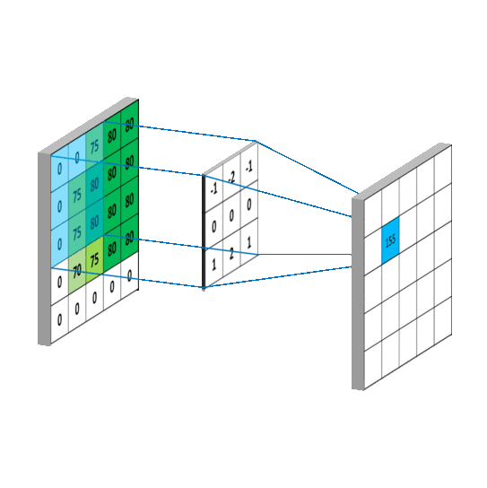

# css 的黑魔法 filter

<ClientOnly>
  <MTA/>
</ClientOnly>

## 融合效果
对于 css 的属性 filter 来讲:

> filter: blur()： 给图像设置高斯模糊效果。 
> filter: contrast()： 调整图像的对比度。

分别给两个圆形设置高斯模糊filter: blur(6px)，得到如下：

  

  

然后给两个圆的背景设置图像对比度filter: contrast(20)，添加白色背景

  

  

然后就发现了神奇的融合效果！

## 看看这些组合
有些融合的部分还多了光环

  

    

    

  

  

    

    

  

  

    

    

  

  

    

    

  

  

    

    

  

## 高斯模糊
图像处理中的一个基础操作就是——`卷积`。`卷积`在图像处理中，卷积操作指的就是使用一个卷积核(kernel)对一张图像中的每个像素进行一系列操作。卷积核通常是一个四方形网格结构。（例如3X3的方形区域），该区域内每个方格都有一个权重值。当对图像中的某个像素进行卷积时，我们会把卷积核的中心放置于该图像上，依次计算核中每个元素和其覆盖的图像像素值的乘积并求和，得到的结果就是该位置的新像素值。——《Unity Shader入门精要》

模糊，就是对图像进行平滑化处理。平滑化处理，就是用平滑滤波函数，生成卷积核对应的权重，然后对图像进行卷积操作。平滑滤波函数很多，包括均值滤波函数，高斯滤波函数(也就是我们说的`高斯模糊`)等。

## 图像对比度
图像对比度指的是一幅图像中明暗区域最亮的白和最暗的黑之间不同亮度层级的测量，即指一幅图像灰度反差的大小。差异范围越大代表对比越大，差异范围越小代表对比越小，好的对比率120:1就可容易地显示生动、丰富的色彩，当对比率高达300:1时，便可支持各阶的颜色。