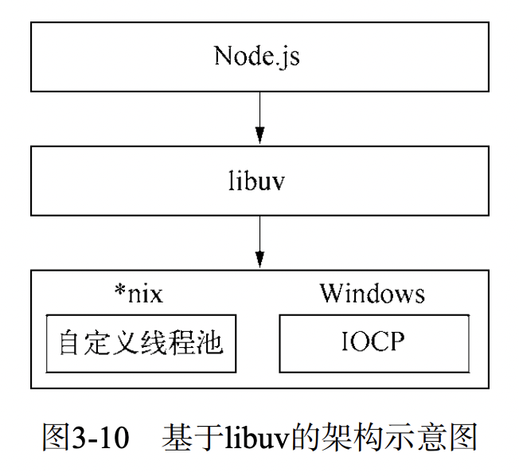
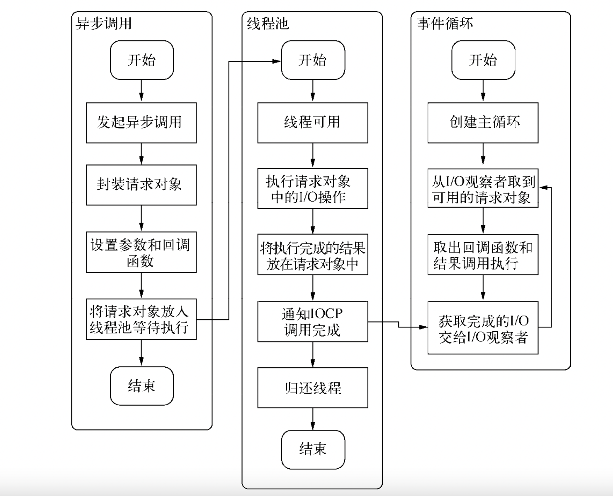
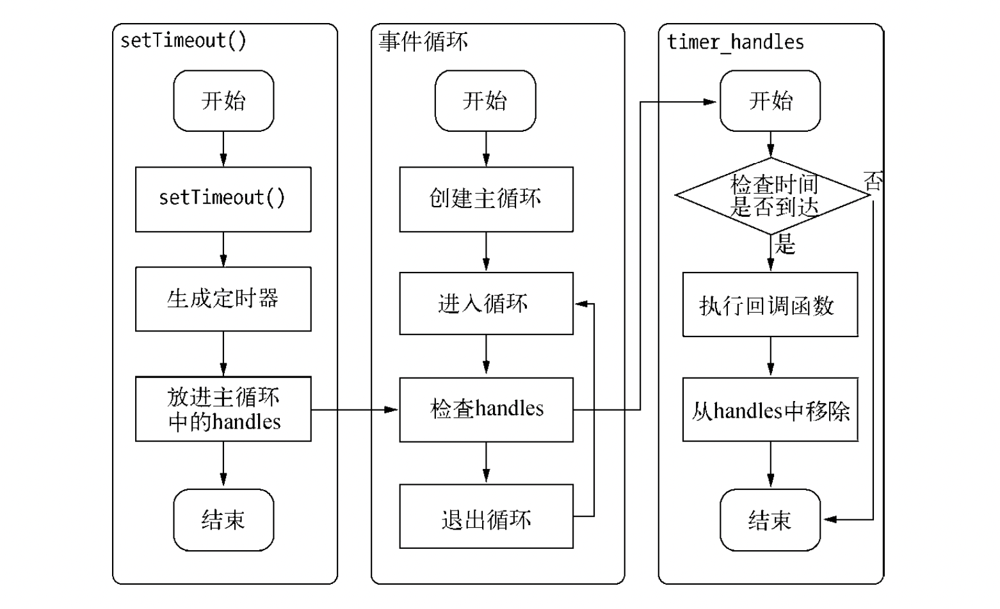

# 事件循环机制/Event loop

## macro（宏任务）和micro（微任务）
### 宏任务
- [`setTimeout`](https://developer.mozilla.org/zh-CN/docs/Web/API/setTimeout)
- [`setInterval`](https://developer.mozilla.org/zh-CN/docs/Web/API/setInterval)
- [`setImmediate`: 非标准: 该特性是非标准的，请尽量不要在生产环境中使用它！](https://developer.mozilla.org/zh-CN/docs/Web/API/Window/setImmediate)[nodejs里是支持的](http://nodejs.cn/learn/understanding-setimmediate)
- `I/O`
- `UI渲染`
- [`postMessage`: window.postMessage() 方法可以安全地实现跨源通信。](https://developer.mozilla.org/zh-CN/docs/Web/API/Window/postMessage)
- [`MessageChannel`: Channel Messaging API 的**MessageChannel** 接口允许我们创建一个新的消息通道，并通过它的两个MessagePort 属性发送数据。](https://developer.mozilla.org/zh-CN/docs/Web/API/MessageChannel)

### 微任务
- [`Promise.then`](https://developer.mozilla.org/zh-CN/docs/Web/JavaScript/Reference/Global_Objects/Promise)
- [`MutationObserver(浏览器)`: MutationObserver 接口提供了监视对 DOM 树所做更改的能力。它被设计为旧的 Mutation Events 功能的替代品，该功能是 DOM3 Events 规范的一部分。](https://developer.mozilla.org/zh-CN/docs/Web/API/MutationObserver)
- [`process.nextTick(Node)`](http://nodejs.cn/learn/understanding-process-nexttick)
- [`queueMicrotask(浏览器)`](https://developer.mozilla.org/en-US/docs/Web/API/HTML_DOM_API/Microtask_guide)
- Object.observe（已废弃；Proxy 对象替代）

## I/O
### 什么是I/O
我们都知道在UNIX世界里一切皆文件，而文件是什么呢？文件就是一串二进制流而已，其实不管是Socket，还是FIFO（First Input First Output，先进先出队列））、管道、终端。对计算机来说，一切都是文件，一切都是流。在信息交换的过程中，计算机都是对这些流进行数据的收发操作，简称为I/O操作（Input andOutput），包括往流中读出数据、系统调用Read、写入数据、系统调用Write。所以I/O不仅仅只限于磁盘文件的读写，*nix将计算机抽象了一番，磁盘文件，硬件、套接字等几乎所有计算机资源都被抽象为了文件。

操作系统内核对于I/O只有两种方式：阻塞与非阻塞。在调用阻塞I/O时，应用程序需要等待
I/O完成才返回结果。
阻塞I/O的一个特点是调用之后一定要等到系统内核层面完成所有操作后，调用才结束。以
读取磁盘上的一段文件为例，系统内核在完成磁盘寻道、读取数据、复制数据到内存中之后，这
个调用才结束。

阻塞I/O造成CPU等待I/O，浪费等待时间，CPU的处理能力不能得到充分利用。为了提高
性能，内核提供了非阻塞I/O。非阻塞跟阻塞I/O的差别为调用之后会立即返回。

操作系统对计算机进行了抽象，将所有输入输出设备抽象为文件。内核在进行文件VO
操作时，通过文件描述符进行管理，而文件描述符类似于应用程序与系统内核之问的凭
证。应用程序如果需要进行I/O调用，需要先打开文件描述符，然后再根据文件描述符去
实现文件的数据读写。此处非阻塞I/O与阻塞I/O的区别在于阻塞I/O完成整个获取数据的过
程，而非阻塞I/O则不带数据直接返回，要获取数据，还需要通过文件描述符再次读取。

非阻塞I/O返回之后，CPU的时间片可以用来处理其他事务，此时的性能提升是明显的。
但非阻塞I/O也存在一些问题。由于完整的I/O并没有完成，立即返回的并不是业务层期望的
数据，而仅仅是当前调用的状态。为了获取完整的数据，应用程序需要重复调用I/O操作来确认
是否完成。这种重复调用判断操作是香完成的技术叫做轮询。

异步I/O方案则是Windows下的IOCP，它在某种程度上提供了理想
的异步I/O：调用异步方法，等待I/O完成之后的通知，执行回调，用户无须考虑轮询。但是它的
内部其实仍然是线程池原理，不同之处在于这些线程池由系统内核接手管理。
IOCP的异步I/O模型与Node的异步调用模型十分近似。在Windows平台下采用了IOCP实现
异步IO。
由于Windows平台和*nix平台的差异，Node提供了[libuv](https://docs.libuv.org/en/v1.x/)作为抽象封装层，使得所有平台兼容性的判断都由这一层来完成，并保证上层的Node与下层的自定义线程池及IOCP之间各自独立。如下是libuv的架构：


::: warning
我们时常提到Node是单线程的，这里的单线程仅仅只是JavaScript执行在单线程中罢了。在Node中，无论是*nix还是Windows平台，内部完成I/O任务的另有线程池。除了Javascript是单线程外，Node自身其实是多线程的，只是I/O线程使用的CPU较少。另一个需
要重视的观点则是，除了用户代码无法并行执行外，所有的I/O（磁盘I/O和网络I/O等）则是可以并行起来的
:::
### BIO、AIO、NIO
这个在node编程里没有体现。但是在java编程里是需要掌握的内容，因为Node本身就是基于异步I/O设计的也就是AIO。

BIO （Blocking I/O）：同步阻塞I/O模式。
NIO （New I/O）：同步非阻塞模式。
AIO （Asynchronous I/O）：异步非阻塞I/O模型。

### node异步I/O
node异步I/O回调的过程：


事件循环、观察者、请求对象、I/O线程池这四者共同构成了Node异步I/O模型的基本要素。

#### 资源分配
假设业务场景中有一组互不相关的任务需要完成，现行的主流方法有以下两种。
- 单线程串行依次执行。
- 多线程并行完成。
如果创建多线程的开销小于并行执行，那么多线程的方式是首选的。多线程的代价在于创建
线程和执行期线程上下文切换的开销较大。另外，在复杂的业务中，多线程编程经常面临锁、状
态同步等问题，这是多线程被诟病的主要原因。但是多线程在多核CPU上能够有效提升CPU的利
用率，这个优势是毋庸置疑的。

单线程顺序执行任务的方式比较符合编程人员按顺序思考的思维方式。它依然是最主流的编
程方式，因为它易于表达。但是串行执行的缺点在于性能，任意一个略慢的任务都会导致后续执
行代码被阻塞。在计算机资源中，通常I/O与CPU计算之间是可以并行进行的。但是同步的编程
模型导致的问题是，I/O的进行会让后续任务等待，这造成资源不能被更好地利用。

操作系统会将CPU的时间片分配给其余进程，以公平而有效地利用资源，基于这一点，有的
服务器为了提升响应能力，会通过启动多个工作进程来为更多的用户服务。但是对于这—组任务
而言，它无法分发任务到多个进程上，所以依然无法高效利用资源，结束所有任务所需的时间将
会较长。这种模式类似于加三倍服务器，达到占用更多资源来提升服务速度，它并没能真正改善
问题。单线程同步编程模型会因阻塞I/O导致硬件资源得不到更优的使用。多线程编程模型也因为
编程中的死锁、状态同步等问题让开发人员头疼。

epoll。该方案是Linux下效率最高的I/O事件通知机制，在进入轮询的时候如果没有检查到
I/O事件，将会进行休眠，直到事件发生将它唤醒。它是真实利用了事件通知、执行回调
的方式，而不是遍历查询，所以不会浪费CPU，执行效率较高。

### 协程(coroutine)
如果你使用支持 ES6 的平台，Node.js 8+，那么就可以原生支持 协程(coroutine)。
也就是generator。而async/await呢又是generator + promise的语法糖。

## node事件循环
node自身的执行模型，就是事件循环。在进程启动时，Node会创建类似while(true)的循环，每一次执行循环体的过程我们称为Tick。每个Tick的过程就是查看是否有事件待处理，如果有，就取出事件及其相关的回调函数。如果存在关联的回调函数，就执行它们。然后进入下个循环，如果不再有事件处理，就退出流程。

事件循环是一个典型的生产者/消费者模型。异步I/O、网络请求等则是事件的生产者，不断的为Node提供不同类型的事件，这些事件被传递到对应的观察者，事件循环则从观察者那里取出事件并处理。

事件循环操作顺序的简化概览：
```
   ┌───────────────────────────┐
┌─>│           timers          │
│  └─────────────┬─────────────┘
│  ┌─────────────┴─────────────┐
│  │     pending callbacks     │
│  └─────────────┬─────────────┘
│  ┌─────────────┴─────────────┐
│  │       idle, prepare       │
│  └─────────────┬─────────────┘      ┌───────────────┐
│  ┌─────────────┴─────────────┐      │   incoming:   │
│  │           poll            │<─────┤  connections, │
│  └─────────────┬─────────────┘      │   data, etc.  │
│  ┌─────────────┴─────────────┐      └───────────────┘
│  │           check           │
│  └─────────────┬─────────────┘
│  ┌─────────────┴─────────────┐
└──┤      close callbacks      │
   └───────────────────────────┘
```
- `timers`：本阶段执行已被`setTimeout`和`setInterval`的调度回调函数
- `pending callbacks`: 执行延迟到下一个循环迭代的 I/O 回调。
- `idle,prepare`: 仅系统内部使用。
- `poll`: 检索新的 I/O 事件;执行与 I/O 相关的回调（几乎所有情况下，除了关闭的回调函数，那些由计时器和 setImmediate() 调度的之外），其余情况 node 将在适当的时候在此阻塞。
- `check`: setImmediate() 回调函数在这里执行。
- `close callbacks`: 一些关闭的回调函数，如：socket.on('close', ...)
在每次运行的事件循环之间，Node.js 检查它是否在等待任何异步 I/O 或计时器，如果没有的话，则完全关闭。

### poll阶段
poll阶段有两个重要的功能：

1. 计算应该阻塞和轮询 I/O 的时间。
2. 然后，处理 `poll(轮询)` 队列里的事件。
当事件循环进入 `poll(轮询)` 阶段且 没有被调度的计时器时 ，将发生以下两种情况之一：
- 如果 `poll(轮询)` 队列 不是空的 ，事件循环将循环访问回调队列并同步执行它们，直到队列已用尽，或者达到了与系统相关的硬性限制
- 如果 `poll(轮询)` 队列 是空的 ，还有两件事发生：
    - 如果脚本被 `setImmediate()` 调度，则事件循环将结束 `poll(轮询)` 阶段，并继续`check`阶段以执行那些被调度的脚本。
    - 如果脚本 未被 `setImmediate()`调度，则事件循环将等待回调被添加到队列中，然后立即执行。
一旦 `poll(轮询)` 队列为空，事件循环将检查 _已达到时间阈值的计时器_。如果一个或多个计时器已准备就绪，则事件循环将绕回计时器阶段以执行这些计时器的回调。


### check阶段
此阶段允许人员在 `poll(轮询)` 阶段完成后立即执行回调。如果`poll(轮询)`阶段变为空闲状态，并且脚本使用 `setImmediate()` 后被排列在队列中，则事件循环可能继续到 `check` 阶段而不是等待。
`setImmediate()` 实际上是一个在事件循环的单独阶段运行的特殊计时器。它使用一个 [libuv](https://docs.libuv.org/en/v1.x/) API 来安排回调在`poll(轮询)`阶段完成后执行。

:::tip libuv
[libuv](https://docs.libuv.org/en/v1.x/)库: 它是Node自身的动力来源之一。Node能够实现跨平台的一个诀窍就是它的libuv库，这个库是跨平台的一层封装，通过它去调用一些底层操作，比自己在各个平台下编写实现要高效得多。libuv封装的功能包括事件循环文件操作等
:::

setImmediate() 和 setTimeout() 很类似，但是基于被调用的时机，他们也有不同表现。
- setImmediate() 设计为一旦在当前 轮询 阶段完成， 就执行脚本。
- setTimeout() 在最小阈值（ms 单位）过后运行脚本。

使用 setImmediate() 相对于setTimeout() 的主要优势是，如果setImmediate()是在 I/O 周期内被调度的，那它将会在其中任何的定时器之前执行，跟这里存在多少个定时器无关。


### close callbacks阶段
如果套接字或处理函数突然关闭（例如 socket.destroy()），则'close' 事件将在这个阶段发出。否则它将通过 process.nextTick() 发出。

## 定时器
setTimeout（）和setInterval（与浏览器中的API是一致的，分别用于单次和多次定时执行任务。它们的实现原理与异步IO比较类似，只是不需要I/O线程池的参与。调用setTimeout()或者setInterval（创建的定时器会被插人到定时器观察者内部的一个红黑树中。每次Tick执行时，会从该红黑树中迭代取出定时器对象，检查是否超过定时时间，如果超过，就形成一个事件，它的回调函数将立即执行。
下图为setTimeout的行为


创建一个定时器，需要动用红黑树、创建定时器对象、迭代等操作。所以这样用setTimeout(fn, 0)较为浪费性能不如process.nextTick()。

process.nextTick()调用，只会将回调函数放入队列，在下一轮Tick时取出执行。定时器中采用红黑树的操作时间复杂度为O(lg(n))， 而process.nextTick的时间复杂度为O(1)

### 与setImmediate的优先级
考虑如下代码
```js
setTimeout(() => {
  console.log('setTimeout')
}, 0)
setImmediate(() => {
  console.log("setImmediate")
})
```
如果从上图node事件循环的简化图，可以得到的结果是，setTimeout和setInterval的回调都执行在`timer`阶段。而setImmediate回调会执行在`poll`检查setTimeediate存在后的`check`的阶段。这样的话，那么会得到结果
```js
// setTimeout
// setImmediate
```
但是某些情况会先打印setImmediate

可能你曾听说定时器存在`"4ms"`的概念。意思低于4ms就不知道时间的先后了。现在的话比如google已经是1ms了。node也是1ms。但是当发生的时间小于1ms。意思你电脑足够快，就有可能setTimeout的时间达不到让其callback推入timer执行的条件。这时候就会发生setImmediate先执行的情况。

### 问题：如何让setImmediate比setTimeout快
保证在事件循环中的`timers`阶段之后调用他们两个。那么无论如何 setImmediate 都会比 setTimeout 快。如果setImmediate()是在 I/O 周期内被调度的，那它将会在其中任何的定时器之前执行跟这里存在多少个定时器无关。
```js
const fs = require('fs');
const path = require('path');

// fs.readFile的回调是在poll阶段执行的,回调执行完毕后poll阶段的队列为空，
// 于是进入check阶段，执行setImmediate回调,而setTimeout的回调需要等到
// 下一个事件循环的timers阶段才去执行

fs.readFile(path.resolve(__dirname, 'package.json'), (err) => {
  setTimeout(() => {
    console.log('timer');
  });

  setImmediate(() => {
    console.log('setImmediate');
  });
});
```

考虑如下代码
```js
setTimeout(() => {
  console.log('setTimeout')
}, 0)
setImmediate(() => {
  console.log("setImmediate")
  console.log("===========================")
})
setTimeout(() => {
  console.log('setTimeout')
}, 0)
setImmediate(() => {
  console.log("setImmediate")
})
setTimeout(() => {
  console.log('setTimeout')
}, 0)
setImmediate(() => {
  console.log("setImmediate")
})
```
结果在第一轮事件循环里，setTimeout优先执行，我的电脑后面的都是setImmediate先执行。
```js
setTimeout
setImmediate
===========================
setImmediate
setImmediate
setTimeout
setTimeout
```
::: danger
但是这样的打印顺序是不准确的。因为setTimeout的存在时间问题。所以是没法比较谁快的，唯一可以确认的是，在异步I/O里setImmediate是先执行的。
:::

## process.nextTick的问题
process.nextTick() 会在各个事件阶段之间执行，一旦执行，要直到nextTick队列被清空，才会进入到下一个事件阶段，所以如果递归调用 process.nextTick()，会导致出现I/O starving（饥饿）的问题，比如下面例子的readFile已经完成，但它的回调一直无法执行。
这是因为嵌套调用的 setImmediate() 回调，被排到了下一次event loop才执行，所以不会出现阻塞。

```js
const fs = require('fs')
const starttime = Date.now()
let endtime

fs.readFile('text.txt', () => {
  endtime = Date.now()
  console.log('finish reading time: ', endtime - starttime)
})

let index = 0

function handler () {
  if (index++ >= 1000) return
  console.log(`nextTick ${index}`)
  process.nextTick(handler)
  // console.log(`setImmediate ${index}`)
  // setImmediate(handler)
}

handler()
```

### 与setImmediate的优先级
```js
process.nextTick(function() {
  console.log('process.nextTick')
});
setImmediate(function() {
  console.log('setImmediate')
})
console.log('233')
```
结果为:
```js
// 233
// process.nextTick
// setImmediate
```
可以看到process.nextTick()中的回调函数执行的优先级要高于setImmediate(）。
这里的原因在于事件循环对观察者的检查是有先后顺序的，process.nextTick()属于idle观察者，setImmediated属于check观察者。在每一个轮循环检查中，idle观察者先于I/O观察者，I/O观察者先于check观察者。
具体实现上，process.nextTick()的回调函数保存在一个数组中，setImmediate()的结果则是保存在链表中。在行为上，process.nextTick()在每轮循环中会将数组中的回调函数全部执行完，而setImmediate()在每轮寻中执行链表中的一个回调函数。

```js
process.nextTick(function() {
  console.log('process.nextTick 1')
})
process.nextTick(function() {
  console.log('process.nextTick 2')
})

setImmediate(function() {
  console.log('setImmediate 1')
  process.nextTick(function() {
    console.log('强势插入')
  })
})
setImmediate(function() {
  console.log('setImmediate 2')
})
console.log('最开始执行')
```
结果：
```js
// 最开始执行
// process.nextTick 1
// process.nextTick 2
// setImmediate 1
// 强势插入
// setImmediate 2
```
从执行结果上可以看出，当第
一个setImmediate()的回调两数执行后，并没有立即执行第二个，而是进人了下一轮循环，再次按process.nextTick(优先、setImediiate()次后的顺序执行。之所以这样设计，是为了保证每轮循环能够较快地执行结束，防止CPU占用过多而阻塞后续I/O
调用的情况。


## 宏/微任务的优先级
### 浏览器里
浏览器里，微任务优先级高于宏任务
[queueMicrotask](https://developer.mozilla.org/en-US/docs/Web/API/HTML_DOM_API/Microtask_guide)和Promise.resolve().then同级的，意思谁放前面谁先执行。
```js
setTimeout(() => {
  console.log('3 setTimeout')
}, 0)
queueMicrotask(() => {
  console.log('1 queueMicrotask')
})
Promise.resolve().then(() => {
  console.log('2 Promise.resolve().then')
})
console.log(0)
```
执行结果:
```js
0
1 queueMicrotask
2 Promise.resolve().then
3 setTimeout
```
### node里
1. 代码块1
```js
setImmediate(() => {
  console.log("4 setImmediate")
})
setTimeout(() => {
  console.log('3 setTimeout')
}, 0)
Promise.resolve().then(() => {
  console.log('2 Promise.resolve().then')
})

process.nextTick(() => {
  console.log(`1 process.nextTick`)
})

console.log(0)
```
执行结果：
```js
0
1 process.nextTick
2 Promise.resolve().then
3 setTimeout
4 setImmediate
```
___
2. 在Promise.resolve().then里，Promise.resolve().then会优先执行
```js
Promise.resolve().then(() => {
  console.log('1 Promise.resolve().then')
  process.nextTick(() => {
    console.log(`3 process.nextTick`)
  })
  Promise.resolve().then(() => {
    console.log('2 Promise.resolve().then')
  })
  process.nextTick(() => {
    console.log(`4 process.nextTick`)
  })
})

console.log(0)
```
执行结果：
```js
0
1 Promise.resolve().then
2 Promise.resolve().then
3 process.nextTick
4 process.nextTick
```

3. 在process.nextTick里，process.nextTick会优先执行
```js
process.nextTick(() => {
  console.log('1 process.nextTick')
  process.nextTick(() => {
    console.log(`2 process.nextTick`)
  })
  Promise.resolve().then(() => {
    console.log('3 Promise.resolve().then')
  })
  process.nextTick(() => {
    console.log(`3 process.nextTick`)
  })
  Promise.resolve().then(() => {
    console.log('4 Promise.resolve().then')
  })
})

console.log(0)
```
执行结果：
```js
0
1 process.nextTick
2 process.nextTick
3 process.nextTick
3 Promise.resolve().then
4 Promise.resolve().then
```

::: warning 提示
这里要注意的点是，process.nextTick和Promise.resolve().then无论写了多少，他们都是在一次tick循环里全部执行了的。
:::

## 浏览器的 Event Loop
比起Node里，浏览器的事件循环就少了些许功能。
- 浏览器里主线程执行完毕后，就检查有没有`微任务队列`。
- 有`微任务队列`，就依次执行所有`微任务`。
- `微任务`执行完毕。检查有没有`宏任务`，有就执行它。
- 执行`宏任务`的过程是，每执行一次`宏任务`就要检查`微任务队列`里有没有`微任务`，有就先执行`微任务`
## 参考
- 《深入浅出nodejs - 朴灵》
- [libuv](https://docs.libuv.org/en/v1.x/)
- [nodejs官网：Node.js 事件循环，定时器和 process.nextTick()](https://nodejs.org/zh-cn/docs/guides/event-loop-timers-and-nexttick/)
- [探究NodeJs中EventLoop与V8下的差异性](https://zhuanlan.zhihu.com/p/484258647)
- [为什么 setTimeout 有最小时延 4ms ?](https://juejin.cn/post/6846687590616137742)
- [基础知识之什么是I/O](https://blog.csdn.net/qq_42052956/article/details/112124163)
- [什么是BIO、NIO、AIO](https://cloud.tencent.com/developer/article/1491073?from=article.detail.1461987)
- [什么是协程?](https://zhuanlan.zhihu.com/p/172471249)
- [Node.js 异步非阻塞 I/O 机制剖析](https://zhuanlan.zhihu.com/p/74119491)
- [Node.js 真的有协程吗？ - justjavac的回答 - 知乎 ](https://www.zhihu.com/question/305443189/answer/551716136)
- [聊一聊协程（上）：从Node.js谈起](https://zhuanlan.zhihu.com/p/91292314)