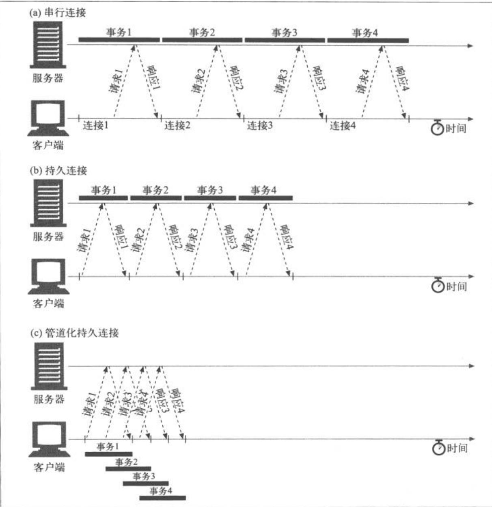
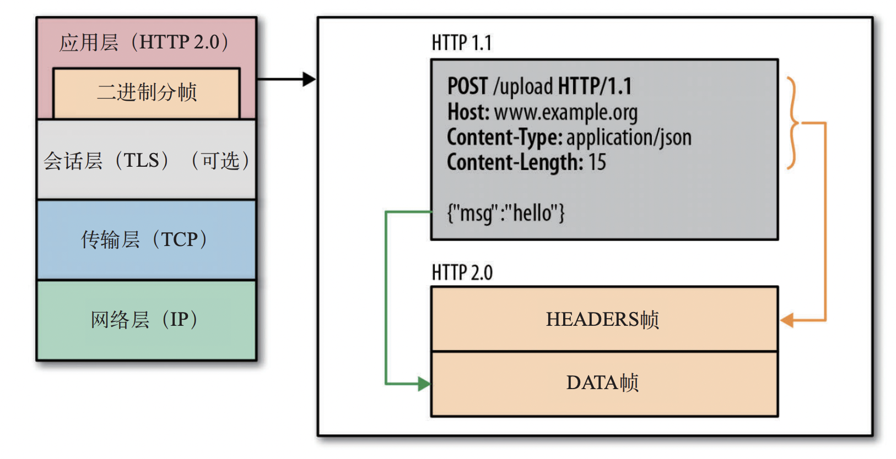
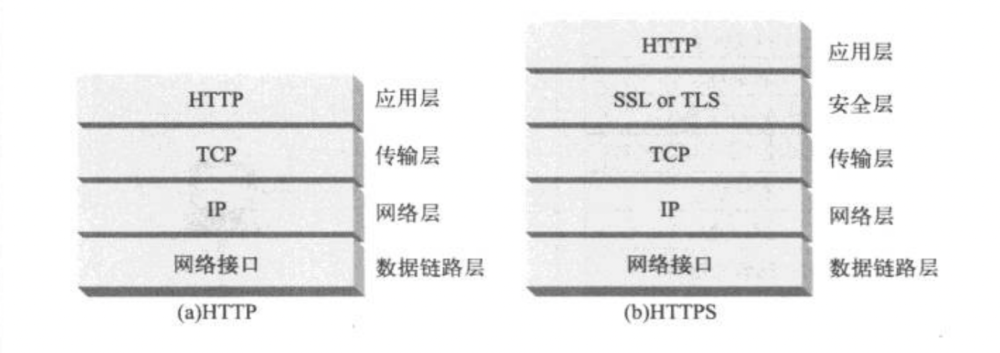

# http

<ClientOnly>
  <MTA/>
</ClientOnly>


## http1.1
### 持久连接(persistent connection)
因为TCP每次建立和断开都增加计算机资源的消耗。所以就有了持久连接技术。它的特点是，只要任意一端没有明确的提出断开连接，则保持TCP连接状态。是取代http1.0+ keep-alive的改进型设计，两者目的相同，但是持久连接的工作机制更优。

与HTTP/1.0+的keep-alive连接不同，HTTP/1.1持久连接在默认情况下是激活
的。除非特别指明，否则HTTP/1.1假定所有连接都是持久的。要在事务处理结束
之后将连接关闭，HTTP/1.1应用程序必须向报文中品式地添加一个Connectioa:
close首部。这是与以前的HTTP协议版本很重要的区别，在以前的版本中，keep-
alive连接要么是可选的，要么根本就不支持。

HTTP/1.1客户端假定在收到响应后，除非响应中包含了Connection:close首
部，不然HTTP/1.1连接就仍维持在打开状态。但是，客户端和服务器仍然可以随
时关闭空闲的连接。不发送Connection:close并不意味着服务器承诺永远将连
接保持在打开状态。

### 持久连接的限制和规则
1. 发送了Connection：close请求首部之后，容户端就无法在那条连接上发送更
多的请求了。
2. 如果容户端不想在连接上发送其他请求了，就应该在最后一条请求中发送一个Connection:close请求首部。
3. 只有当连接上所有的报文都有正确的、自定义报文长度时，也就是说，实体主体部分的长度都和相应的Content-Length一致，或者是用分块传输编码方式编码的，连接才能持久保持。

4. HTTP/1.1的代理必须能够分别管理与客户端和服务器的持久连接。
5. （由于较老的代理会转发connection首部，所以）HTTP/1.1的代理服务器不应该与HTTP/1.0客户端建立持久连接，除非它们了解客户端的处理能力。实际上，这一点是很难做到的，很多厂商都违背了这一原则。
6. 尽管服务器不应该试图在传输报文的过程中关闭连接，而且在关闭连接之前至少应该响应一条请求，但不管Connection首部取了什么值，HTTP/1.1设备都可以在任意时刻关闭连接。

7. HTTP/1.1应用程序必须能够从异步的关闭中恢复出来。只要不存在可能会累积
起来的副作用，客户端都应该重试这条请求。
8. 除非重复发起请求会产生副作用，否则如果在客户端收到整条响应之前连接关闭
了。客户端就必须要重新发起请求。
9. 一个用户客户端对任何服务器或代理最多只能维护两条持久连接，以防服务器过
载。代理可能需要更多到服务器的连接来支持并发用户的通信，所以，如果有
N个用户试图访问服务器的话，代理最多要维持2N条到任意服务器或父代理的连接。

### 管道化连接
因为每个 TCP 连接同时只能处理一个请求 - 响应，浏览器按FIFO(先进先出)原则处理请求，如果上一个响应没返回，后续请求、响应都会受阻。所以出现了该技术。

HTTP/1.1允许在持久连接上可选地使用请求管道。这是在keep-alive连接上的进一
步性能优化。在响应到达之前，可以特多条请求放人队列。当第一条请求通过网络
流向地球另一端的服务器时，第二条和第三条请求也可以开始发送了。在高时延网
络条件下，这样做可以降低网络的环回时间，提高性能。


对管道化连接有几条限制。
1. 如果HTTP客户端无法确认连接是持久的，就不应该使用管道。
2. 必须按照与请求相同的顺序回送HTTP响应。HTTP报文中没有序列号标签，因
此如果收到的响应失序了，就没办法将其与请求匹配起来了。
3. HTTP客户端必须做好连接会在任意时刻关闭的准备，还要准备好重发所有未完成的管道化请求。如果客户端打开了一条持久连接，并立即发出了10条请求，服务器可能在只处理了，比方说,5条请求之后关闭连接。剩下的5条请求会失败，客户端必须能够应对这些过早关闭连接的情况，重新发出这些请求。

4. HTTP客户端不应该用管道化的方式发送会产生副作用的请求（比如POST)。总之，出错的时候，管道化方式会阻碍客户端了解服务器执行的是一系列管道化请求中的哪一些。由于无法安全地重试POST这样的非幂等请求，所以出错时，就存在某些方法永远不会被执行的风险。



### 队头阻塞问题
所有的HTTP请求是连续发送的，但是其响应是串行返回的（因为管道化要求服务端按照请求发送的顺序返回响应（FIFO 先进先出）原因是HTTP请求和响应并没有序号标识，无法将乱序的响应与请求关联起来，所以要求按顺序返回），那么当后面的响应都返回了，而第一个响应因为延迟等原因没有返回的话，客户端一样也没办法处理，虽然按照没有延迟等理想情况来说，这样确实会提高文件传输效率，但是网络中经常会有延迟等情况，所以只要第一个的响应没有及时到达，后面的响应到了也没法处理。（其实这个和TCP队头阻塞有些像。
::: danger 提示
虽然http2.0[多路复用](#多路复用)解决了这个问题但是, TCP层的队头阻塞没有被解决。导致 HTTP/2 在更容易丢包的弱网络环境下比 HTTP/1.1 更慢！最根本的原因是HTTP2协议基于TCP有序字节流实现，因此应用层的多路复用并不能做到无序地并发，在丢包场景下会出现队头阻塞问题导致。
:::

## http2.0
### 多路复用
在一个 TCP 连接上，我们可以向对方不断发送帧，每帧的 stream identifier 的标明这一帧属于哪个流，然后在对方接收时，根据 stream identifier 拼接每个流的所有帧组成一整块数据。
把 HTTP/1.1 每个请求都当作一个流，那么多个请求变成多个流，请求响应数据分成多个帧，不同流中的帧交错地发送给对方，这就是 HTTP/2 中的多路复用。

就是将6~30个并行TCP连接切换到单个底层TCP连接。
### 头部压缩
使用[HPACK](https://httpwg.org/specs/rfc7541.html)这是一种用于高效表示HTTP头字段的压缩格式。里面采用了三种压缩方式：静态表、动态表、压缩算法(Huffman/哈夫曼编码，最高压缩比8:5)。

`静态表`类似，用`2`代表`GET`请求、`31`代表`content-type`字段，这样key-value对应的表。

`动态表`可以简单理解为在请求过程中映射的 `索引表`，比如第一个请求`帧（frame）` 使用 `静态表`+ `Huffman算法` 构成的索引表（`静态表`+`动态表`）可以在下一次请求 `帧（frame）` 中只需要传递新增的内容使用`Huffman算法`，不变的内容就可以使用 `索引表` 中的值（和`静态表`类似）替代。

> HTTP/3头部压缩是用的[QPACK](https://datatracker.ietf.org/doc/html/draft-ietf-quic-qpack)

### 流与二进制分帧
帧是数据传输的最小单位，以二进制传输代替原本的明文传输，原本的报文消息被划分为更小的数据帧。
HTTP 2就是在应用层上模拟了一下传输层TCP中“流”的概念，从而解决了HTTP 1.x协议中的队头拥塞的问题，在1.x协议中，HTTP 协议是一个个消息组成的，同一条TCP连接上，前面一个消息的响应没有回来，后续的消息是不可以发送的。在HTTP 2中，取消了这个限制，将所谓的“消息”定义成“流”，流跟流之间的顺序可以是错乱的，但是流里面的帧的顺序是不可以错乱的。

#### 二进制分帧层
HTTP 2.0 性能增强的核心，全在于新增的二进制分帧层（如图所示）。它定义了如何
封装 HTTP 消息并在客户端与服务器之间传输。


### 流量控制
多路复用的流会竞争 TCP 资源，进而导致流被阻塞。流量控制是一种预防发送端过多向接收端发送数据的机制，TCP和http2的流量控制机制上是一样的。因为TCP流量控制不能对同一条HTTP2.0连接内的多个流实施差异化策略，所以http2就自己实现。

在同一个 TCP 连接上传输多个数据流，就意味着要共享带宽。标定数据流的优先级有助于按序交付，但只有优先级还不足以确定多个数据流或多个连接间的资源分配。为解决这个问题，HTTP 2.0 为数据流和连接的流量控制提供了一个简单的机制：
- 流量控制基于每一跳进行，而非端到端的控制；
- 流量控制基于窗口更新帧进行，即接收方广播自己准备接收某个数据流的多少字
节，以及对整个连接要接收多少字节；
- 流量控制窗口大小通过 WINDOW_UPDATE 帧更新，这个字段指定了流 ID 和窗口大小
递增值；
- 流量控制有方向性，即接收方可能根据自己的情况为每个流乃至整个连接设置任
意窗口大小；
- 流量控制可以由接收方禁用，包括针对个别的流和针对整个连接。
> HTTP 2.0 连接建立之后，客户端与服务器交换 SETTINGS 帧，目的是设置
双向的流量控制窗口大小。除此之外，任何一端都可以选择禁用个别流或
整个连接的流量控制。

### 服务端推送
服务器可以对一个客户端请求发送多个响应。意思除了最初请求的响应外，服务器还可以额外向客户端推送资源，无需客户端明确地请求。
> 建立 HTTP 2.0 连接后，客户端与服务器交换 SETTINGS 帧，借此可以限定
双向并发的流的最大数量。因此，客户端可以限定推送流的数量，或者通
过把这个值设置为 0 而完全禁用服务器推送。

#### 这个机制能做什么？
通常的 Web 应用都由几十个资源组成，客户端需要分析服务器提供的文档才能逐个找到它们。那为什么不让服务器提前就把这些资源推送给客户端，从而减少额外的时间延迟呢？服务器已经知道客户端下一步要请求什么资源了，这时候服务器推送即可派上用场。
> 所有推送的资源都遵守同源策略。换句话说，服务器不能随便将第三方资
源推送给客户端，而必须是经过双方确认才行。

有了服务器推送后，HTTP 1.x 时代的大多数插入或嵌入资源的做法基本上也就过时
了。唯一有必要直接在网页中插入资源的情况，就是该资源只供那一个网页使用，
而且编码代价不大
### 最佳实践
::: warning 不推荐这样使用
1. 域名分片
HTTP/2 对于同一域名使用一个 TCP 连接足矣，过多 TCP 连接浪费资源而且效果不见得一定好而且资源分域会破坏 HTTP/2 的优先级特性，还会降低头部压缩效果。
2. 资源合并
资源合并会不利于缓存机制，而且单文件过大对于 HTTP/2 的传输不好，尽量做到细粒化更有利于 HTTP2/传输。但是这并不是所有情况都这样，需要具体测试。

3. 资源内联
HTTP/2 支持 Server-Push，相比较内联优势更大效果更好。而且内联的资源不能有效缓存。如果有共用，多页面内联也会造成浪费。
:::

使用 HTTP/2 尽可能用最少的连接，因为同一个连接上产生的请求和响应越多，动态表积累得越全，头部压缩效果也就越好，而且多路复用效率高，不会像多连接那样造成资源浪费。

为此需要注意以下两点:

- 同一域名下的资源使用同一个连接，这是 HTTP/2 的特性
- 不同域名下的资源，如果满足能解析到同一 IP 或者使用的是同一个证书(比如泛域名证书)，HTTP/2 可以合并多个连接

所以使用相同的 IP 和证书部署 Web 服务是目前最好的选择，因为这让支持 HTTP/2 的终端可以复用同一个连接，实现 HTTP/2 协议带来的好处；而只支持 HTTP/1.1 的终端则会不同域名建立不同连接，达到同时更多并发请求的目的。
## http3.0
http2.0与http3的结构


HTTP/3是在UDP之上构建的，HTTP/3更快，因为就像是UDP一样没有等待握手、队头阻塞。这个说法是问题的。UDP被QUIC使用，主要是因为UDP在互联网上（几乎）所有设备上能用。QUIC基本重新实现了TCP的功能。只不过这些实现，比TCP更智能，更高效。所以QUIC任然会建立连接，并具有高度复杂的握手。HTTP/3并不比HTTP/2快，因为我们把TCP换成了UDP，并重新实现了更高级版本的TCP版本，将其称为QUIC。因为想让QUIC容易部署，所以通过UDP运行它。

QUIC已经深度集成TLS1.3了。

::: tip 关键词
`RTT(Round-Trip Time)`: 往返时延。

`QUIC`的全称是(Quick UDP Internet Connections)，是由 Google 从 2013 年开始研究的基于 UDP 的可靠传输协议，它最早的原型是 SPDY + QUIC-Crypto + Reliable UDP，后来经历了 SPDY 转型为 2015 年 5 月 IETF 正式发布的 HTTP/2.0，以及 2016 年 TLS/1.3 的正式发布。2016 年成立，IETF 的 QUIC 标准化工作组启动，考虑到 HTTP/2.0 和 TLS/1.3 的发布，它的核心协议族逐步进化为现在的 HTTP/3.0 + TLS/1.3 + QUIC-Transport 的组合。
:::

### 拥赛控制

从理论上讲，QUIC受到的数据包丢失（和相关线路负责人队头阻塞）的影响较小，因为它独立处理每个资源字节流的数据包丢失。此外，QUIC运行在用户数据报协议(UDP)上，与TCP不同，该协议没有内置`拥塞控制`功能：它允许您尝试以任何您想要的速度发送，并且不会重新传输丢失的数据。

这导致许多文章声称QUIC也不使用`拥塞控制`，QUIC可以开始以比UDP更高的速度发送数据（取决于删除队头阻止来处理数据包丢失），这就是为什么QUIC比TCP快得多。

实际上，没有什么比这更离事实了。QUIC实际上使用与TCP非常相似的带宽管理技术。它也从较低的发送速率开始，并随着时间的推移而增长，使用确认作为衡量网络容量的关键机制。这是（除其他原因外）是因为QUIC需要可靠才能对HTTP等有用，因为它需要对其他QUIC(和TCP!）公平连接，并且因为它的HOI阻塞删除实际上并不能很好地防止数据包丢失。

然而，这并不意味着QUIC不能比TCP更聪明地管理带宽。这主要是因为QUIC比TCP更灵活，更容易进化。正如我们所说，`拥塞控制`算法今天仍在大幅发展，例如，我们可能需要调整一些东西来充分利用5G。

QUIC的灵活性将带来更多的实验和更好的`拥塞控制`算法，这反过来也可以反向移植到TCP来改进它。

意思QUIC并不会比TCP更快地下载网站资源。但是它的灵活性意味着尝试新的`拥塞控制`算法将变得更容易，未来可能会改善TCP和QUIC的情况。

::: warning 提示
**拥塞控制**和**流量控制**是两个不同的功能。对于网页加载来说，流量控制作用要小很多。
:::

如图为TCP+TLS+QUIC的连接设置。


可能会有文章讲，QUIC比TCP快两到三次，而不仅仅是一次。这是因为大多数文章考虑最坏情况的组合为TCP + TLS1.2而不是TCP + TLS1.3。一次往返的提速很好。但是还是没快多少，特别是在网络好的情况（不到50毫秒的RTT）,几乎不明显。

::: tip 为啥不直接第一次时发送HTTP请求？

主要是因为，这样做了，那么第一个请求将被`无加密`发送，有可存在隐私和安全的问题。而且TCP握手存在的原因之一就是，它允许客户端在发送任何更高级别的数据之前，确保服务器在给定的IP地址实际上**可用**。

QUIC不受四元组（源 IP、源端口、目的 IP、目的端口）的影响，客户端主要由其IP地址标识。那么IP就有可能造假。黑客利用这个方式，一直发给服务器请求。服务器又不知道是不是来自于真的用户，服务器也会返回数据（虽然客户端对能不能收到数据并不关心）。最后超过服务器的承载就会崩了。这是正是DDoS攻击的方式。
> QUIC的一种优化(TLS1.3对比TSL1.2也有这功能)：我们现在可以安全地发送我们的第一个HITTP请求以及QUIC/TLS握手，节省了另一次往返！至于TLS1.3，这有效地消除了TLS握手的等待时间。这种方法通常被称为o-RTT

虽然还有其他的问题，幸运的是，QUIC可以选择让情况变得更好。例如，服务器可以检查o-RTT是否来自之前有有效连接的IP。然而，只有当客户端保持在同一网络上时，这才有效（这在某种程度上限制了QUIC的`连接迁移`功能）。即使它有效，QUIC的响应仍然受到我们上面讨论的拥塞控制器缓慢启动逻辑的限制：因此，除了节省一次往返行程外，没有额外的大规模速度提升。

QUIC使用。o-RTT进行更快的连接设置实际上更像是一种微观优化，而不是革命性的新功能。与最先进的TCP+TIS1.3设置相比，它最多可以节省一次往返。在第一次往返旅行中实际可以发送的数据量还受
到一些安全考虑的限制。因此，如果您的用户在具有非常高延迟的网络上（例如，超过200毫
秒`RIT的卫星网络`），或者如果您通常不发送太多数据，此功能就变得耀眼。后者的一些例子是大量缓存的网站，以及通过API和其他协议（如`DNS-over-QUIC`）定期获取小更新的单页应用程序。在其他情况下，您充其量只能获得几十毫秒的提升，如果您已经在使用CDN，则更少。
:::

### 连接迁移
TCP 连接基于四元组（源 IP、源端口、目的 IP、目的端口），切换网络连接时至少会有一个因素发生变化，导致连接发生变化。当连接发生变化时，如果还使用原来的 TCP 连接，则会导致连接失败，就得等原来的连接超时后重新建立连接，所以我们有时候发现切换到一个新网络时，即使新网络状况良好，但内容还是需要加载很久。如果实现得好，当检测到网络变化时立刻建立新的 TCP 连接，即使这样，建立新的连接还是需要几百毫秒的时间。
基于TCP四元组确定一个连接，这种诞生于有线网络的设计，并不适合移动状态下的无线网络，这意味着IP地址的频繁变动会导致TCP连接、TLS会话反复握手，成本高昂。


QUIC 的连接不受四元组的影响，当这四个元素发生变化时，原连接依然维持。那这是怎么做到的呢？道理很简单，QUIC 连接不以四元组作为标识，而是使用一个 64 位的随机数，这个随机数被称为 Connection ID，即使 IP 或者端口发生变化，只要 Connection ID 没有变化，那么连接依然可以维持。

但是切换网络，连接也需要重置其发送速率。这项技术会用在大文件下载、实时视频会议和流媒体。切换网络，不能保证新网络和旧网络的带宽一样。因此即使连接完好无损，QUIC服务器也不能一直高速发送数据。相反，为了避免新网络过载，它需要重置（或降低）发送速率，并在`拥塞控制`的`慢启动`阶段重新启动。
因为这个初始发送速率通常太低，无法真正支持视频流，所以即使在QUIC上，您也会看到一些质量损失之类的小问题。在某种程度上，`连接迁移`更多的是防止`连接上下文`的失效增加服务器的开销。而不是为了提高性能。

### 队头阻塞消除
::: tip 提示
- HTTP/1.1 有队头阻塞，因为它需要完整地发送响应，并且不能多路复用它们
- HTTP/2 通过引入“帧”（frames）标识每个资源块属于哪个“流”（stream）来解决这个问题
然而，TCP 不知道这些单独的“流”（streams），只是把所有的东西看作一个大流（1 big stream）
- 如果一个 TCP 包丢失，所有后续的包都需要等待它的重传，即使它们包含来自不同流的无关联数据。TCP 具有传输层队头阻塞。
:::

假设我们有两个数据(两条流)，A1代表第一条流的第一个数据帧，总的有三个数据帧。
- A1 A2 A3
- B1 B2 B3

数据在TCP的传输里，如下所示。它的数据传输是有顺序的，如果传A3给丢包丢了，就要等A3好。
```
- 待传：       A3 
        B1 B2 B3
- 已传： A1 A2
```

在QUIC里传的时候，数据包就知道自己属于那条流上的。这就是QUIC比TCP聪明的地方。
```
- 待传： [] A2 A3
        [] B2 B3
- 已传： A1 [] []
        B1 [] []
```
如果传A2的过程，数据包A2丢失了，他就不用等就继续传A3的，到时候A2好了自己传过来到对应的位置。
```
- 待传： [] A2 A3
        [] B2 B3
- 已传： A1 [] A3
        B1 [] []
```
然后等A2好了，就变成这样
```
- 待传： [] [] A3
        [] B2 B3
- 已传： A1 A2 A3
        B1 [] []
```

这种方式，就会导致QUIC数据可能不能再以发送时完全相同的顺序发送到浏览器, 用上面的例子就是先发的A在发的B，有可能会先是B的流发送完了，A才好。TCP的队头阻塞就是以完全相同的顺序发送的。

看起来上面的方式消除了`队头阻塞`, 但那是在两种流的情况，要是我数据只有一个文件(一种流)，那还是必须等的。也就是说，这个`队头阻塞消除`需要建立在多个资源流的情况才有效。
所以关键的问题来了，要是网页不需要多个资源并行加载的时候，多路复用的模式就得需要不同的策略了。

#### 多路复用的问题
不同的多路复用，可能会对不同浏览器中的加载产生不同的影响。原因很复杂看这两文章：
[文章1](https://h3.edm.uhasselt.be/files/ResourceMultiplexing_H2andH3_Marx2020.pdf)，[文章2](https://speeder.edm.uhasselt.be/www18/files/h2priorities_mwijnants_www2018.pdf)

造成这样的结果很容易解释，因为网页里的js,css文件需要是完整的网页才能绘制页面和执行js。虽然使用`多路复用`会可能导致每个资源总体完成时间的延迟。但是对于大多数网页资源来讲，`顺序多路复用`效果是最好的。

假设，我们要传三组数据，下面每个字母代表一个数据包。
- AAAA
- BBBB
- CCCC
1. 循环多路复用
```
ABCABCABCABC
```
实际上会延迟每个资源的总完成时间，因为它们都需要与其他资源共享带宽。如果是网页的资源就一定需要等待（js文件，css文件的`数据包`）全部加载完毕才可以把`数据包`组成文件。这样的话，就等同于，把资源加载完了，才开始运行网页，这样网页就是啥反应没有突然间渲染好了，会给用户有很大延迟的感觉。


2. 顺序多路复用
```
AAAABBBBCCCC
```
对于顺序多路复用，网页可以先加载好可用的那一部分，给到用户的反馈，这样用户有感知，就觉得网页是一直加载中的。即使它和`循环多路复用`加载到网页渲染的时间是一样的，但是用户还是觉得有反馈的感觉会更快。


::: danger
目前这块东西也在处于一个探索阶段，没有万精油。
:::
## https
HTTPS就是在安全的传输层上发送的HTTP。HTTPS没有将未加密的HTTP报
文发送给TCP，并通过世界范围内的因特网进行传输，它在将
HTTP报文发送给TCP之前，先将其发送给了一个安全层，对其进行加密。
这个S指的就是SSL/TLS。



### TLS/SSL握手
> TLS是SSL在3.0版本的时候copy了一份变为新的TLS1.0。

此处为TLS1.2版本详细握手过程：
1. 客户端发送`Client Hello`、`客户端支持的TLS版本`、`支持的加密套件`、随机数1给服务器。
2. __服务器发送`Server Hello`、确认支持的`TLS版本`、选择的`加密套件`、随机数2给客户端。__
2. __服务器发送`Certificate`、`自己的证书`给客户端。(客户端根据自己证书的信任列表来确认这个服务器是否可信)__
2. __服务器发送`Server Key Exchange`、`公钥`发给客户端。(如果服务器需要客户端的证书，就可以在这里发出请求。)__
2. __服务器最后就发送`Server Hello Done`表示自己发完了。__

3. 客户端收完后发送这三段给服务器。
    - `Client Key Exchange`，包含用刚刚服务器发的`公钥`加密新生成随机数3（也叫做`预主秘钥`）得到的结果。
    - `Change Cipher Spec`（告诉服务器后面的数据用商议好的算法和秘钥加密）
    - `Encrypted Handshake Message`（表示客户端没有啥问题了）

4. __服务器发送Encrypted Handshake Message字符串，表示自己准备好了。__

> 至此TLS已经握手成功。


8. 服务器收到加密后的`预主秘钥`会用自己的私钥解密得到`预主秘钥`。

9. 客户端和服务端都用`预主秘钥`、随机数1、随机数2计算出`会话秘钥`。两者得到的`会话秘钥`是相同的而且只在当前会话阶段生效。然后客户端和服务端就能用对称加密愉快的交流了。


__这个过程看得出前面`非对称加密`消耗了很多资源，是为了得到一个会话秘钥。得到秘钥后，就变`对称加密`了__。
## 参考
- 《图解 HTTP》
- 《HTTP 权威指南》
- 《Web 性能权威指南》
- [HTTP2 详解](https://blog.wangriyu.wang/2018/05-HTTP2.html)
- [详解 HTTP/2 头压缩算法 —— HPACK](https://halfrost.com/http2-header-compression/)
- [HTTP/2 协议-HPACK（HTTP2 头部压缩算法）原理介绍](https://blog.csdn.net/qq_38937634/article/details/111410191)
- [深入理解 Web 协议 (三)：HTTP 2 - vivo互联网技术的文章 - 知乎](https://zhuanlan.zhihu.com/p/352345803)
- [HTTP/3 原理实战 - 腾讯技术工程的文章 - 知乎](https://zhuanlan.zhihu.com/p/143464334)
- [HTTP3 RFC标准正式发布，QUIC 会成为传输技术的新一代颠覆者吗？](https://mp.weixin.qq.com/s/9fz0OlRNtkoqlUrmak2Xtw)
- [深入剖析HTTP3协议](https://www.nginx.org.cn/article/detail/422)

- [HTTP/3 From A To Z: Core Concepts - 作者Robin Marx（HTTP/3和QUIC工作组成员）](https://www.smashingmagazine.com/2021/08/http3-core-concepts-part1/)
- [HTTP/3: Performance Improvements (Part 2) - 作者Robin Marx（HTTP/3和QUIC工作组成员）](https://www.smashingmagazine.com/2021/08/http3-performance-improvements-part2/)
- [HTTP/3: Practical Deployment Options (Part 3) - 作者Robin Marx（HTTP/3和QUIC工作组成员](https://www.smashingmagazine.com/2021/09/http3-practical-deployment-options-part3/)
- [Head-of-Line Blocking in QUIC and HTTP/3: The Details  - 作者Robin Marx（HTTP/3和QUIC工作组成员](https://calendar.perfplanet.com/2020/head-of-line-blocking-in-quic-and-http-3-the-details/)

- [对话Robin Marx：HTTP/3和QUIC将带来重大机遇和挑战](https://juejin.cn/post/7120549550292467742)
- [QUIC: A UDP-Based Multiplexed and Secure Transport](https://www.rfc-editor.org/rfc/rfc9000.html#name-cryptographic-and-transport)


## 扩展链接
- [RFC2616，“超文本传输协议-HTTP/1.1%是HTTP/1.1的官方规范](http://www.ietf.org/rfc/rfc2616.txt)，解释了井行、持久和管道式HTTP连接的使用，以及用于实现这些连接的HTTP首部宇
段。此文档并未酒盖对底层TCP连接的正确使用。

- [RFC2068是HTTP/1.1协议的1997年的版本](http://www.ietf.org/rfc/rfc2068.txt)，其中包含了RFC2616中没有的、对HTTP/1.0+keep-alive连接的解释。

- [HPACK: Header Compression for HTTP/2](https://datatracker.ietf.org/doc/html/rfc7541)
- [QPACK: Header Compression for HTTP/3 draft-ietf-quic-qpack-21](https://datatracker.ietf.org/doc/html/draft-ietf-quic-qpack)
- [HTTP/2 Prioritization and its Impact on Web Performance](https://speeder.edm.uhasselt.be/www18/files/h2priorities_mwijnants_www2018.pdf)
- [Resource Multiplexing and Prioritization in HTTP/2 over TCP versus HTTP/3 over QUIC](https://h3.edm.uhasselt.be/files/ResourceMultiplexing_H2andH3_Marx2020.pdf)