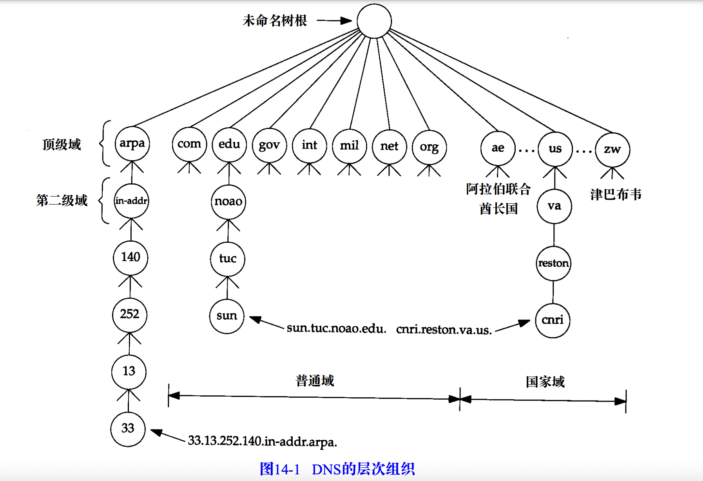
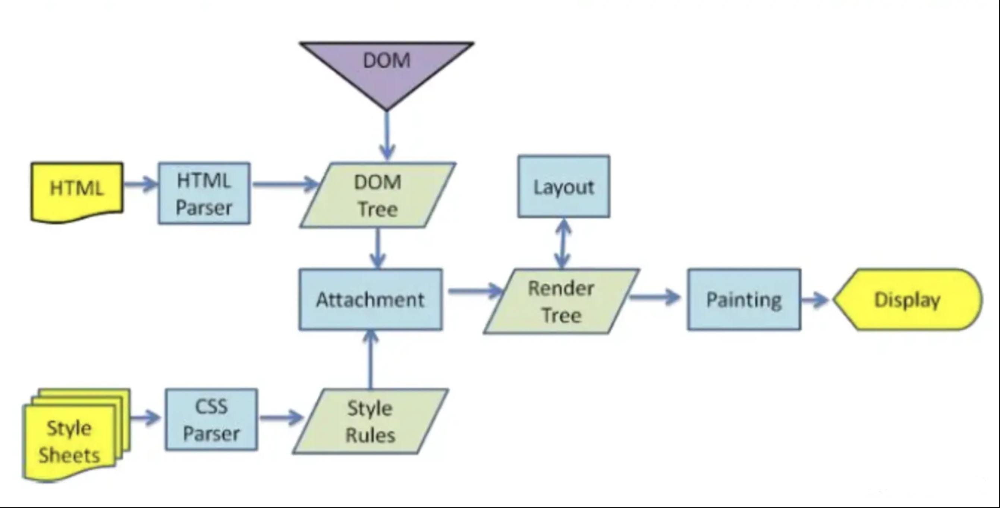

# 浏览器从输入url发生了什么[未完...]

<ClientOnly>
  <MTA/>
</ClientOnly>

## 输入的域名解析
1. 浏览器会对输入的url进行解析。缺的部分浏览器会尝试进行补全得到一个合法的URL地址。
2. 然后浏览器会优先查自己有没有缓存。有的话从自己的缓存里读取出来。
3. 没有的话url就会给到操作系统。操作系统就会进到自己的缓存里查。
## 进入hosts文件（操作系统缓存）
host文件是一个用于储存计算机网络中各节点信息的计算机文件。由用户控制。

host文件里，会有些域名和ip的对应列表。如果输入的url能匹配上，那么会直接返回这个对应的ip地址。

如果没有查到，操作系统就会发送TCP/UDP到DNS服务器。
::: tip 提示
DNS名字服务器使用的熟知端口号无论对UDP还是TCP都是53。这意味着DNS均
支持UDP和TCP访问。主要使用UDP访问。

当名字解析器发出一个查询请求，并且返回响应中的DNS报文，其首部的标志字段`TC（删减标志）比特`被设置为1时，
它就意味着响应的长度超过了512个字节，而仅返回前512个字节。在遇到这种情况时，名字
解析器通常使用TCP重发原来的查询请求，它将允许返回的响应超过512个字节（在许多UDP应用
程序的设计中，其应用程序数据被限制成512字节或更小，DNS的报文大小也被限制了）。既然TCP能将用户的数据流分为一些报文段，它就能用多个报文段来传送任意长度的用户数据。

:::

## DNS解析
域名系统（DNS）是一种用于 TCP/IP应用程序的分布式数据库，它提供主机名字和IP地
址之间的转换及有关电子邮件的选路信息。

::: tip 提示
域名其实是具有一定的层次结构的，从上到下依次为：根域名、顶级域名（top level domain，TLD）、二级域名、（三级域名）

:::

### 查询

DNS的查询方式主要是，递归查询，迭代查询。

A: 根域名服务器  B: 顶级域名服务器 C: 二级域名服务器
- 递归查询: 你问A，A问B，B问C。C知道，C就告诉B,  B又告诉A。A告诉你结果。
- 迭代查询：你问A，A让你问B，你去问B， B让你问C，你又去问C。你自己问完C后得到了结果。

::: tip 提示
1. 主机和本地域名服务器之间的查询方式是递归查询。
2. 本地域名服务器和其他域名服务器之间的查询方式是迭代查询，防止根域名服务器压力过大。
:::

DNS服务器就在等待的时间做下面的事情
1. `DNS解析器`得到域名后，会查询自己的缓存。（因为自己也会缓存上次的查询结果）。
2. 如果自己的缓存没命中，就会向根域名发起查询请求，要求返回顶级域名（如.com）的地址。
3. 然后，根DNS服务器会注意到请求地址的前缀并向 DNS 解析器返回 com 的`顶级域名服务器(TLD)` 的 IP 地址列表。
4. `DNS解析器`就又向`顶级域名服务器(TLD)`发起查询报文。
5. `顶级域名服务器(TLD)`就会根据域名的地址把`权威 DNS 服务器`的 IP 地址返回给 `DNS解析器`。
6. DNS 解析器将查询直接发送到`权威 DNS 服务器`
7. 权威DNS服务器会将IP地址返回给`DNS解析器`
8. 操作系统得到IP就给浏览器。浏览器这会儿才发起http请求。

## http请求
http在网络七层协议中，属于应用层。是建立在http1.1和2.0是建立在TCP上的应用，http3.0目前是建立在UDP上的应用。

在发起真正的网络请求之前，浏览器会先从`浏览器缓存`中查询是否有要请求的文件。有的话直接返回。

当请求为http的时候，默认情况下就会打开一条到服务器的80端口，并发送http命令。
### SSL/TLS
> TLS是SSL在3.0版本的时候copy了一份变为新的TLS1.0。
当请求的url为https的时候发生这一阶段。默认会打开一条到服务器的443端口。

在发送加密的http报文之前，客户端与服务器要进行一次SSL握手，这个过程为

- 交换协议版本号
- 选择一个两端都了解的密码
- 对两端的身份进行认证
- 生成临时会话秘钥，以便加密信道

详细见[计算机网络相关/https/TLS握手部分](/zh/network/http.html#ssl握手)

## TCP

服务器和客户端的状态有：
- SYN_SEND （同步发送状态）
- LISTEN  （监听等待状态）
- SYN_RCVD （同步收到状态）
- ESTABLISHED （已投入使用状态）
- FIN_WAIT_1（终止等待1状态）
- FIN_WAIT_2（终止等待2状态）
- LAST_ACK （最后确认状态）
- TIME_WAIT （最后的终止等待状态）
- CLOSED （关闭状态）
### （TCP的连接过程）三次握手

::: tip 术语：
- SYN是请求同步的意思，synchronization(同步)的缩写。 
- ACK是确认同步的意思，acknowledgement(确认)的缩写。
:::

1. 请求端发送[SYN 1001](#tcp)。（一个`SYN（synchronization同步）`段指明客户打算连接的服务器的端口，以及初始序号为[1001](#tcp)。
> 客户端进入 SYN_SEND （同步发送状态）
2. 服务端一次发回下面两个：
    - `SYN 2000` （包含服务器初始序列号，假设序列号为`2000`）
    - [ACK 1002](#tcp)  (请求端给的初始序列号1000加1的结果[1002](#tcp))
> 服务器由LISTEN进入SYN_RCVD （同步收到状态）
3. 请求端拿到2000然后加1得到结果`2001`，发送`ACK 2001` （synchronization同步）报文段给服务端
> 当客户发送ack时，客户端进入ESTABLISHED 状态;当服务收到客户发送的ack后，也进入ESTABLISHED （已投入使用状态）;第三次握手可携带数据;

这样就完成了三次握手，主要就是谁发了`SYN 序列号`过去，另一个就要回复`ACK 序列号 + 1`。

### （TCP断开的过程）四次挥手
::: tip 术语：
- FIN是终止的意思，Finish(终止)的缩写。
:::
1. 客户端发[FIN 1002](#tcp)，`ACK 2001`。
> 客户端状态由ESTABLISHED （已投入使用状态）进入FIN_WAIT_1（终止等待1状态）
2. 服务端第一次发  `ACK 2001`。
> 服务器状态由ESTABLISHED （已投入使用状态）进入CLOSE_WAIT（关闭等待）；客户端收到ACK段后，由FIN_WAIT_1（终止等待1状态）进入FIN_WAIT_2（终止等待2状态）；
3. 服务端第二次发 `FIN 2001` [ACK 1003](#tcp)。
> 服务器状态由CLOSE_WAIT（关闭等待） 进入 LAST_ACK （最后确认状态）
4. 客户端发`ACK 2003` 。
> 客户端状态由FIN_WAIT_2（终止等待2状态）进入TIME_WAIT（最后的终止等待状态），等待2MSL时间（MSL是Max Segment Lifetime最长报文寿命的缩写），进入CLOSED（关闭状态）；服务器在收到最后一次ACK后，由LAST_ACK（最后确认状态）进入CLOSED（关闭状态）；

::: tip 为什么需要等待2MSL?
- 最后一个报文没有确认；
- 确保发送方的ACK可以到达接收方；
- 2MSL时间内没有收到，则接收方会重发；
- 确保当前连接的所有报文都已经过期。
::: 
## 浏览器资源缓存策略
浏览器的缓存，主要是基于http协议的。

### 1. 强缓存
直接从缓存中读取资源，强缓存可以通过设置两种 HTTP Header 实现：Expires 和 Cache-Control
> Cache-Control优先级高于Expires。如果 Expires 和 Cache-Control: max-age 都可用，则将 max-age 定义为首选。因此，由于 HTTP/1.1 已被广泛使用，无需特地提供 Expires。

- `Expires`：缓存过期时间，用来指定资源到期的时间，是服务器端具体的时间点，超过这个时间缓存就过期。
Expires 是 HTTP/1.0 的产物，受限于本地时间，如果修改了本地时间，可能会造成缓存失效。
- `Cache-Control`: HTTP/1.1 的产物，比如当设置Cache-Control:max-age=300，单位是s，代表5分钟内再次请求就会走强缓存
  - `Cache-Control:no-cache` 告诉浏览器忽略资源的缓存副本，强制每次请求直接发送给源服务器。这个实际上是可以存储在本地缓存区中的。只是在与原始服务器进行新鲜度再验证之前，缓存不能将其提供给客户端使用。这个首部使用do-not-serve-from-cache-without-revalidation这个名字会更恰当一些。
    - http1.1提供Pragma: no-cache首部是为了兼容于HTTP/1.0+。
  - `Cache-Control:no-store` 强制缓存在任何情况下都不要保留任何副本
  - `Cache-Control:max-stale` 缓存可以随意提供过期的文件。如果指定了参数max-stale=600,在这600秒时间内，文档就不能过期。
  - `Cache-Control:min-fresh=[秒]` 至少在多少秒内文档要保持新鲜。
  - `Cache-Control:max-age=[秒]` 指明缓存副本的有效时长，从请求时间开始到过期时间的秒数。如果max-age=0这样，代表马上过期。会让强缓存失效。
  - `Cache-Control: s-maxage=[秒]` 会覆盖max-age指令，但只在公共缓存中生效。max-age 和 s-maxage 结合使用可以让你针对私有缓存和公共缓存（例如代理、CDN）分别设定不同的刷新时间
  - `Cache-Control:must-revalidate,max-age=600` 响应首部告诉缓存，在事先没有跟原始服务
器进行再验证的情况下，不能提供这个对象的陈旧副本。缓存仍然可以随意提供新鲜的副本。如果在缓存进行must-revalidate新鲜度检查时，原始服务器不可用，缓存就必须返回一条504 Gateway Timeout错误。意思大概就是已经验证过的600秒内就先读缓存的，超过后就重新验证。
  - `Cache-Control: proxy-revalidate` 和 s-maxage 一脉相承，proxy-revalidate 是公共缓存版的 must-revalidate。它被私有缓存简单地忽略掉了。
  - `Cache-Control:only-if-cached` 只有当缓存中有副本存在时，客户端才会获取一份副本 
  - `Cache-Control:no-transform` 无论在请求还是响应中，缓存都不能改变实体主体的媒体类型。比如中间的服务会gzip的压缩，图片转webp等。当你是https，中间和代理都不能改你的数据时，这个就没用了。

  - `Cache-Control:public` 任何途径的缓存（本地缓存，代理服务器），都可以缓存
  - `Cache-Control:private` 针对单个缓存资源和public相对。
  - `Cache-Control: max-age=600, immutable` 就是一种告诉浏览器一个文件永远都不会改变的方法。它是不可变的，因此不要再费心重新验证它，比如style.css和style.ae3f66.css 这个有hash的css就基于文件内容指纹，当被修改后它会变名字。我们可以完全减去造成延迟的往返开销。在支持 immutable 的浏览器中，只要没超过 600 秒的新鲜寿命，用户刷新也不会造成重新验证。这意味着避免了响应 304 的往返请求，这可能会节约我们在关键路径上（CSS blocks rendering）的大量延迟。在高延迟的场景里，这种节约是可感知的。
  - `Cache-Control: max-age=86400, stale-while-revalidate=600` 当我们检查验证新版本的资源时，允许浏览器在这段宽限期期间使用过期的（旧的）资源。这里代表86400秒过后，在600秒内你还能使用旧的资源。
  - `Cache-Control: max-age=2419200, stale-if-error=86400` 与上面的stale-while-revalidate类似。如果重新验证资源时返回了 5xx 之类的错误，stale-if-error 会给浏览器一个使用旧的响应的宽限期。

### 2. 协商缓存
协商缓存就是强制缓存失效后，浏览器携带缓存标识向服务器发起请求，由服务器根据缓存标识决定是否使用缓存的过程
协商缓存可以通过设置两种 HTTP Header 实现：Last-Modified 和 ETag
- `Last-Modified/If-Modified-Since`:
http1.0
原理：浏览器第一次访问资源时，服务器会在response头里添加Last-Modified时间点，这个时间点是服务器最后修改文件的时间点，然后浏览器第二次访问资源时，检测到缓存文件里有Last-Modified，就会在请求头里加If-Modified-Since，值为Last-Modified的值，服务器收到头里有If-Modified-Since，就会拿这个值和请求文件的最后修改时间作对比，如果没有变化，就返回304，如果小于了最后修改时间，说明文件有更新，就会返回新的资源，状态码为200

- `ETag/If-None-Match`
http1.1
原理：与Last-Modified类似，只是Last-Modified返回的是最后修改的时间点，而ETag是每次访问服务器都会返回一个新的token，第二次请求时，该值埋在请求头里的If-None-Match发送给服务器，服务器在比较新旧的token是否一致，一致则返回304通知浏览器使用本地缓存，不一致则返回新的资源，新的ETag，状态码为200

::: tip 为啥会需要If-None-Match?

因为有些情况下仅使用最后修改日期进行再验证是不够的。
  - 有些文档可能会被周期性地重写（比如，从一个后台进程中写入），但实际包含
的数据常常是一样的。尽管内容没有变化，但修改日期会发生变化。
  - 有些文档可能被修改了，但所做修改井不重要，不需要让世界范围内的缓存都重
装数据（比如对拼写或注释的修改）。
  - 有些服务器无法准确地判定其页面的最后修改日期。
  - 有些服务器提供的文档会在亚秒间隙发生变化（比如，实时监视器），对这些服务器来说，以一秒为粒度的修改日期可能就不够用了。
为了解决这些问题，HTTP允许用户对被称为实体标签ETag）的“版本标识符”进行比较。实体标签是附加到文档上的任意标签（引用宇符串）。它们可能包含了文档的序列号或版本名，或者是文档内容的校验和及其他指纹信息。

当发布者对文档进行修改时，可以修改文档的实体标签来说明这个新的版本。这样，如果实体标签被修改了，缓存就可以用If-sone-Match条件首部来GET文档的新副本了。

ETag更精确，性能上Last-Modified好点
:::
### 3. 默认
如果什么缓存策略都不设置。这种情况，浏览器会采用一个启发式的算法，通常会取响应头中的 Date 减去 Last-Modified 值的 10% 作为缓存时间

## 网页渲染
webkit 流程

Mozilla 的Geoko的主要流程

Gecko 里把格式化好的可视元素称做“帧树”（Frame tree）。每个元素就是一个帧（frame）。 webkit
则使用”渲染树”这个术语，渲染树由”渲染对象”组成。webkit
里使用”layout”表示元素的布局，Gecko则称为”reflow”。Webkit使用”Attachment”来连接DOM节点与可视化信息以构建渲染树。一个非语义上的小差别是Gecko在HTML与DOM树之间有一个附加的层
，称作”content sink”，是创建DOM对象的工厂。

CSSOM (CSS Object DOM、CSS对象模型) 提供了接口让js获得修改css代码设置的样式信息。对于内部和外部的样式表，CSSOM (CSS Object DOM、CSS对象模型)提供了样式表接口，称为CSSStyleSheet

### 构建DOM树和Style Rules
浏览器会将HTML资源自上而下开始解析成一个DOM树，DOM 树的构建过程是一个深度遍历过程：当前节点的所有子节点都构建好后才会去构建当前节点的下一个兄弟节点。
如果遇到 style 的内联样式和 link 会将 css 交由 css 渲染器构建 css 规则树； 其中加载 link 引入的外部样式文件是异步加载的，并且整个 css 规则树也是与 dom 树的构建是并行的；

在解析html的时候，如果有js脚本，就会阻塞dom的解析。通常我们会给js标签加上defer/async的属性延迟加载。
#### script脚本的加载
将 JavaScript 插入 HTML 的主要方法是使用的script。其中几个属性的作用
- `async`：可选。表示应该立即开始下载脚本，但不能阻止其他页面动作，比如下载资源或等待其 他脚本加载。只对外部脚本文件有效。  （设置了该属性的js脚本。都是自己执行自己的和其他脚本不会有依赖关系
- `defer`：可选。表示脚本可以延迟到文档完全被解析和显示之后再执行。只对外部脚本文件有效。 在 IE7 及更早的版本中，对行内脚本也可以指定这个属性。（和设置了同样defer属性的有依赖关系）
- `src`：可选。表示包含要执行的代码的外部文件。浏览器在解析这个资源时，会向 src 属性指定的路径发送一个 GET 请求，以取得相应资源。

使用了 src 属性的标签中再包含其他 JavaScript 代码。如果两者都提供的话，则浏览器只会下载并执行脚本文件，从而忽略行内代码。

JavaScript的加载、解析与执行会阻塞DOM的构建，也就是说，在构建DOM时，HTML解析器若遇到了JavaScript，那么它会暂停构建DOM，将控制权移交给JavaScript引擎，等JavaScript引擎运行完毕，浏览器再从中断的地方恢复DOM构建。

这是因为JavaScript不只是可以改DOM，它还可以更改样式，也就是它可以更改CSSOM（CSS Object Model，CSS对象模型）。前面我们介绍，不完整的CSSOM（CSS Object Model，CSS对象模型）是无法使用的，但JavaScript中想访问CSSOM（CSS Object Model，CSS对象模型）并更改它，那么在执行JavaScript时，必须要能拿到完整的CSSOM（CSS Object Model，CSS对象模型）。所以就导致了一个现象，如果浏览器尚未完成CSSOM（CSS Object Model，CSS对象模型）的下载和构建，而我们却想在此时运行脚本，那么浏览器将延迟脚本执行和DOM构建，直至其完成CSSOM（CSS Object Model，CSS对象模型）的下载和构建。也就是说，在这种情况下，浏览器会先下载和构建CSSOM（CSS Object Model，CSS对象模型），然后再执行JavaScript，最后在继续构建DOM。

为了更好的用户体验，渲染引擎将会尽可能早的将内容呈现到屏幕上，并不会等到所有的html都解析完成之后再去构建和布局render树。它是解析完一部分内容就显示一部分内容，同时，可能还在通过网络下载其余内容。

### render tree的构建

### 页面绘制

## 分层
## 图层绘制

## GPU光栅化

## 参考
- 《HTTP权威指南》
- 《图解HTTP》
- 《TCP-IP详解卷一：协议》
- 《JavaScript高级编程第四版》
- [MDN HTTP缓存](https://developer.mozilla.org/zh-CN/docs/Web/HTTP/Caching#%E6%A6%82%E8%A7%88)
- [[译] 写给大家看的 Cache-Control 指令配置](https://juejin.cn/post/6844903810897281038)
- [[英文原版] 写给大家看的 Cache-Control 指令配置](https://csswizardry.com/2019/03/cache-control-for-civilians/)
- [GPU图形微架构学习笔记（二）光栅化](https://zhuanlan.zhihu.com/p/433303673)