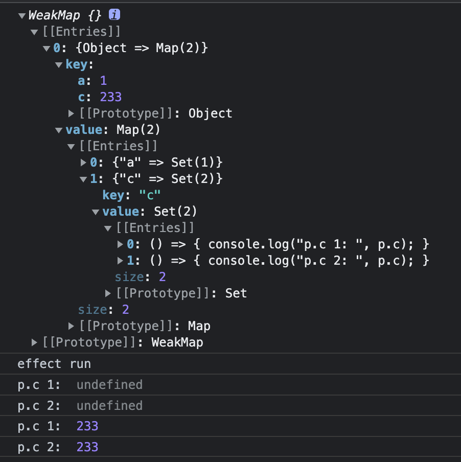

# vue3源码

<ClientOnly>
  <MTA/>
</ClientOnly>

## 源码结构
vue3是一个pnpm的[Monorepo项目](https://pnpm.io/zh/pnpm-workspace_yaml)

```txt
.
├── packages              里面是Monorepo工程里的子项目
│   ├── compiler-core         模板解析核心，与具体环境无关，主要生成 AST，并根据 AST 生成 render() 函数
│   ├── compiler-dom          浏览器环境中的模板解析逻辑，如处理 HTML 转义、处理 v-model 等指令
│   ├── compiler-sfc          负责解析 Vue 单文件组件
│   ├── compiler-ssr          服务端渲染环境中的模板解析逻辑
│   ├── reactivity            响应式数据相关逻辑
│   ├── reactivity-transform  vue的rfc实验性功能（不稳定的功能块，可能会被移除）
│   ├── runtime-core          与平台无关的运行时核心
│   ├── runtime-dom           浏览器环境中的运行时核心
│   ├── runtime-test          用于自动化测试的
│   ├── server-renderer       用于 SSR 服务端渲染的
│   ├── sfc-playground        vue单文件的运行测试
│   ├── shared                一些各个包之间共享的公共工具
│   ├── size-check            一个用于测试 tree shaking 后代码大小的示例库
│   ├── template-explorer     用于检查模板编译后的输出代码
│   ├── vue                   Vue3 的主要入口，包含不同版本的包
│   └── vue-compat            Vue2迁移Vue3用的兼容
├── scripts
├── test-dts
├── pnpm-lock.yaml
├── pnpm-workspace.yaml       Monorepo项目所需
├── rollup.config.js
├── api-extractor.json
├── jest.config.js
├── netlify.toml
├── BACKERS.md
├── CHANGELOG.md
├── LICENSE
├── README.md
├── SECURITY.md
├── package.json
└── tsconfig.json
```

## 模块
带有-browser字样的esm资源是直接给<script type ="module"\>使用的
带有-bundler是给打包工具使用的
## Tree-Shaking副作用移除注释
```js
import { foo } from './utils'
/*#__PURE__*/ foo()
```
注释代码告诉rollup.js、webpack、压缩的terser。 对于foo函数的调用不会产生副作用，可以摇掉。
## 特性开关
```js
if (__FEATURE_OPTIONS_API__) {
  //...
}
```
“当 Vue.js 构建资源时，如果构建的资源是供打包工具使用的（即带有 -bundler 字样的资源），那么上面的代码在资源中会变成”
```js
if (__VUE_OPTIONS_API__) {
}
```
__VUE_OPTIONS_API__是一个特性开关
可以在，webpack.DefinePlugin开启特性
```js
new webpack.DefinePlugin({
  __VUE_OPTIONS_API__: JSON.stringify(true)
})
```

## 错误处理
```js
// 源码vue3/core/packages/runtime-core/src/errorHandling.ts
export function callWithErrorHandling(
  fn: Function,
  instance: ComponentInternalInstance | null,
  type: ErrorTypes,
  args?: unknown[]
) {
  let res
  try {
    res = args ? fn(...args) : fn()
  } catch (err) {
    handleError(err, instance, type)
  }
  return res
}
```

## 响应式系统
依赖绑定原理，利用Proxy劫持对象的属性，当对象读的时候，把当前对象所在的`effect函数`给保存下来。写入的时候执行`effect函数`
```js{9,14}
let obj = {
  a: 1
};

const bucket = new Set(); // 用于存储依赖，执行的函数

const p = new Proxy(obj, {
  get(target, prototype, receiver) { // 读取拦截
    bucket.add(effect) // 存储依赖函数
    return target[prototype]
  },
  set(target, prototype, newVal, receiver) { // 写入拦截
    target[prototype] = newVal;
    bucket.forEach(fn => fn()); // 执行依赖函数
  }
})

function effect() {
  document.body.innerText = p.a
}
effect()
setTimeout(() => {
  p.a = 233
}, 1000)
```

##### 分析如下代码
```js
let obj = {
  a: 1
}
let p = Proxy(obj, {
  // ...
})
effect(() => {
  console.log('effect run')
  document.body.innerText = p.a
})
```
构建一个关系:
```txt
target   <------------- 表示原始对象obj，我们用WeekMap存储它
  prototype <---------- 原始对象的属性obj的a属性，我们用Map存储它
    effect  <---------- 表示effect函数, 我们用Set存储它
```

关于effect函数，因为有存在执行多次的情况，如
```js
effect(() => {
  console.log('effect run')
  document.body.innerText = p.a
})
effect(() => {
  p.a = p.a + 1
})
```
这个关系就变为
```txt
obj
  a
    effect
    effect
```

伪代码
```js
let obj1 = {
  a: 1,
  b: 2
}
let obj2 = {
  c: 1
}

let bucket = new WeakMap()// 用来存储所有依赖对象

let map1 = new Map()
map1.set("a", new Set([effect1]))
map1.set("b", new Set([effect1, effect2]))


let map2 = new Map()
map2.set("c", new Set([effect1]))

bucket.set(obj1, map1)
bucket.set(obj2, map2)
```

##### 代码实现
```js{10-19,24-26}
let obj = {
  a: 1
};

let activeEffect;
const bucket = new WeakMap(); // 构建全局的bucket存储
// 1、WeakMap只接受对象作为key，如果设置其他类型的数据作为key，会报错。
// 2、WeakMap的key所引用的对象都是弱引用，只要对象的其他引用被删除，垃圾回收机制就会释放该对象占用的内存，从而避免内存泄漏。
// 3、由于WeakMap的成员随时可能被垃圾回收机制回收，成员的数量不稳定，所以没有size属性。

const p = new Proxy(obj, {
  get(target, prototype, receiver) { // 读取时触发
    if (!activeEffect) return target[prototype] // 如果依赖函数为空，直接返回属性的值
    let depsMap = bucket.get(target) // 先判断有没有存储obj对应的map依赖
    if (!depsMap) {
      bucket.set(target, depsMap = new Map()) // 如果没有obj对应的依赖，那么就往全局bucket添加obj
    }
    let deps = depsMap.get(prototype); // 取得obj的属性对应的存effect依赖的Set集合
    if (!deps) {
      depsMap.set(prototype, deps = new Set()) // 第一次进来没有的话，就创建空Set
    }
    deps.add(activeEffect) // 根据prototype往Set里添加对应的函数，也就是根据prototype绑定对应的effect函数
    return target[prototype] // 返回属性值
  },
  set(target, prototype, newValue, receiver) {// 数据被修改后触发
    target[prototype] = newValue
    let m = bucket.get(target) // 获取bucket里对应obj的map依赖
    let set = m.get(prototype) // 获取属性对应的Set，然后准备执行Set里的effect函数
    set && set.forEach(fn => fn()) // 改变变量后执行对应的绑定的effect函数
  },

})


function effect(fn) {
  activeEffect = fn // 存储依赖函数的引用，等我们执行fn里的函数，如果读取p.a那么，就把这个activeEffect存起来，下次p.a如果被修改之类的，就又执行这个activeEffect
  fn()
}


effect(() => {
  console.log('effect run')
  document.body.innerText = p.a // 这里读取a会触发代理的get操作，get操作就开始构建obj和a对应的依赖存到bucket里
})

effect(() => {
  console.log('p.c 1: ', p.c) // 读取c，触发get操作，建立obj和c和当前传入函数的依赖关系
})
effect(() => {
  console.log('p.c 2: ', p.c) // 读取c，触发get操作，建立obj和c和当前传入函数的依赖关系
})

setTimeout(() => {
  p.c = 233 // 触发set操作，就会把上面建立的依赖的函数，又重新执行一遍
}, 1000)
```
##### 结果


2. 增加副作用依赖记录，并且每次执行结束副作用函数要清除副作用函数
```js{21,34-39,43}
let obj = {
  a: 1,
  c: 233,
};

let activeEffect;
const bucket = new WeakMap();

const p = new Proxy(obj, {
  get(target, prototype, receiver) {
    if (!activeEffect) return target[prototype];
    let depsMap = bucket.get(target);
    if (!depsMap) {
      bucket.set(target, (depsMap = new Map()));
    }
    let deps = depsMap.get(prototype);
    if (!deps) {
      depsMap.set(prototype, (deps = new Set()));
    }
    deps.add(activeEffect);
    activeEffect.deps.push(deps); // 存储依赖的set
    return target[prototype];
  },
  set(target, prototype, newValue, receiver) {
    target[prototype] = newValue;
    let m = bucket.get(target);
    let set = new Set(m.get(prototype)); // 重新new set避免，fn函数里执行了删除set里元素导致无限循环的问题。
    set && set.forEach((fn) => fn()); // 改变变量后执行对应的副作用函数
  },
});

function effect(fn) {
  let effectFn = () => {
    for (let i = 0; i < effectFn.deps.length; i++) {
      // 从记录依赖的set移除副作用函数
      let v = effectFn.deps[i];
      v.delete(fn);
    }
    effectFn.deps.length = 0;
    activeEffect = effectFn; // 存储副作用函数的引用，相比较之前就可以不关心函数的名称了
    fn();
  };
  effectFn.deps = [];
  effectFn();
}

effect(() => {
  console.log("effect run");
  document.body.innerText = p.a == 1 ? `p.a=${p.a}` : `p.c=${p.c}`;
});

setTimeout(() => {
  p.a = 233;
}, 1000);
```


3. 增加嵌套effect的能力
```js{28-32,36,46,48-49}
let obj = {
  a: 1,
  c: 233,
};

let activeEffect;
const bucket = new WeakMap();

const p = new Proxy(obj, {
  get(target, prototype, receiver) {
    if (!activeEffect) return target[prototype];
    let depsMap = bucket.get(target);
    if (!depsMap) {
      bucket.set(target, (depsMap = new Map()));
    }
    let deps = depsMap.get(prototype);
    if (!deps) {
      depsMap.set(prototype, (deps = new Set()));
    }
    deps.add(activeEffect);
    activeEffect.deps.push(deps); // 存储依赖的set
    return target[prototype];
  },
  set(target, prototype, newValue, receiver) {
    target[prototype] = newValue;
    let m = bucket.get(target);
    let set = new Set(m.get(prototype)); // 重新new set避免，fn函数里执行了删除set里元素导致无限循环的问题。
    set && set.forEach((fn) => {
      if (activeEffect != fn){ // 避免 p.a = p.a + 1的get和set同时触发导致死循环的问题
        fn()
      }
    }); // 改变变量后执行对应的副作用函数
  },
});

let effectStack = []
function effect(fn) {
  let effectFn = () => {
    for (let i = 0; i < effectFn.deps.length; i++) {
      // 从记录依赖的set移除副作用函数
      let v = effectFn.deps[i];
      v.delete(fn);
    }
    effectFn.deps.length = 0;
    activeEffect = effectFn; // 存储副作用函数的引用，相比较之前就可以不关心函数的名称了
    effectStack.push(effectFn)
    fn();
    effectStack.pop()
    activeEffect = effectStack[effectStack.length - 1] // 嵌套情况，activeEffect的值会被覆盖，所以执行完毕fn后要重置为之前的值
  };
  effectFn.deps = [];
  effectFn();
}

effect(() => {
  console.log("effect 1");
  effect(() => {
    console.log("effect 2");
    let temp = p.c
  });
  let temp = p.a
});
p.a = 233
```

## 插槽

### 插槽的本质和要注意的问题
对于一个简单的插槽而言，`插槽`的本质就是一个当如下代码中`Comp`组件渲染执行时，执行的一个函数，这个函数会返回`插槽`的内容，并在`Comp`里显示。
```vue
<template>
 <Comp>
   <template #header>Header</template>
 </Comp>
</template>
```
它会被编译为
```ts{7-9}
import { createTextVNode as _createTextVNode, resolveComponent as _resolveComponent, withCtx as _withCtx, openBlock as _openBlock, createBlock as _createBlock } from "vue"

export function render(_ctx, _cache, $props, $setup, $data, $options) {
  const _component_Comp = _resolveComponent("Comp")

  return (_openBlock(), _createBlock(_component_Comp, null, {
    header: _withCtx(() => [
      _createTextVNode("Header")
    ]),
    _: 1 /* STABLE */
  }))
}
```
当该插槽存在v-if或v-for时，vue会认为它是一个`DYNAMIC_SLOTS`，这里我们暂且称为`异步插槽`。
```vue
<template>
 <Comp>
   <template v-if="show" #header>Header</template>
 </Comp>
</template>
```
`异步插槽`会被编译为
```js{7-15}
import { createTextVNode as _createTextVNode, resolveComponent as _resolveComponent, withCtx as _withCtx, createSlots as _createSlots, openBlock as _openBlock, createBlock as _createBlock } from "vue"

export function render(_ctx, _cache, $props, $setup, $data, $options) {
  const _component_Comp = _resolveComponent("Comp")

  return (_openBlock(), _createBlock(_component_Comp, null, _createSlots({ _: 2 /* DYNAMIC */ }, [
    (_ctx.show)
      ? {
          name: "header",
          fn: _withCtx(() => [
            _createTextVNode("Header")
          ]),
          key: "0"
        }
      : undefined
  ]), 1024 /* DYNAMIC_SLOTS */))
}
```
如果show变量所在的组件有数据发生了变化，则会触发该render的重新执行。那么这时候Comp组件就会被重新渲染，即使Comp组件里没有任何数据被改变。要解决这个问题，vue为我们提供了v-memo的指令，传入依赖项，这样就可以避免Comp的重新渲染。
```vue
<template>
  <Comp v-memo="[show]">
    <template v-if="show" #header>Header</template>
  </Comp>
</template>
```
使用v-memo后，Comp组件会被用`_withMemo`进行包裹，初次运行得到结果后，下一次的更新就要进行依赖比较再更新，这里`v-memo`很像是react的`useMemo(() => (show && <>Header</>), [show])`的感觉。
```js{6}
import { createTextVNode as _createTextVNode, resolveComponent as _resolveComponent, withCtx as _withCtx, createSlots as _createSlots, createVNode as _createVNode, withMemo as _withMemo } from "vue"

export function render(_ctx, _cache, $props, $setup, $data, $options) {
  const _component_Comp = _resolveComponent("Comp")

  return _withMemo([_ctx.show], () => _createVNode(_component_Comp, null, _createSlots({ _: 2 /* DYNAMIC */ }, [
    (_ctx.show)
      ? {
          name: "header",
          fn: _withCtx(() => [
            _createTextVNode("Header")
          ]),
          key: "0"
        }
      : undefined
  ]), 1024 /* DYNAMIC_SLOTS */), _cache, 0)
}
```
当然解决这个问题，除了v-memo外，我们还有种方法，那就是让其需要v-if隐藏的部分变成一个节点或者组件。
```vue
<template>
  <Comp>
    <template #header>
      <template v-if="show">
        Header
      </template>
    </template>
  </Comp>
</template>
```
解析得到的结果
```js
import { createTextVNode as _createTextVNode, Fragment as _Fragment, openBlock as _openBlock, createElementBlock as _createElementBlock, createCommentVNode as _createCommentVNode, resolveComponent as _resolveComponent, withCtx as _withCtx, createBlock as _createBlock } from "vue"

export function render(_ctx, _cache, $props, $setup, $data, $options) {
  const _component_Comp = _resolveComponent("Comp")

  return (_openBlock(), _createBlock(_component_Comp, null, {
    header: _withCtx(() => [
      (_ctx.show)
        ? (_openBlock(), _createElementBlock(_Fragment, { key: 0 }, [
            _createTextVNode(" Header ")
          ], 64 /* STABLE_FRAGMENT */))
        : _createCommentVNode("v-if", true)
    ]),
    _: 1 /* STABLE */
  }))
}
```
这是什么原理呢？这是因为上面讲过当插槽存在v-if或者v-for的时候才会被解析为一个`DYNAMIC_SLOTS`。如果该插槽html上不存在v-if或v-for，vue模板解析的时候，就不会给解析为一个`DYNAMIC_SLOTS`。

上述方法需要vue版本为3.2.40以上
### slot源码
解析模板字符串的时候，关于是插槽的时候判断是否是异步的源码, 在`buildSlots`函数里的判断，找到if或者for都会被直接设置为`DYNAMIC_SLOTS`。

vue3/core/packages/compiler-core/src/transforms/vSlot.ts
```js
  /// ...
  if ((vIf = findDir(slotElement, 'if'))) {
    hasDynamicSlots = true
    ///...
  } 
  ///...
  else if ((vFor = findDir(slotElement, 'for'))) {
    hasDynamicSlots = true
  }

  /// ...
```

对于_createSlot函数，第一个参数传入静态插槽，第二个参数会传入如下`异步插槽`的代码。传入
```js
{
  name: "header",
  fn: _withCtx(() => [
    _createTextVNode("Header")
  ]),
  key: "0"
}
```
有key的存在时，则该`异步插槽`函数会被多包装一层，以延迟调用，没有的话则不需要包装。

vue3/core/packages/runtime-core/src/helpers/createSlots.ts
```js{22-30}
/**
 * Compiler runtime helper for creating dynamic slots object
 * @private
 */
export function createSlots(
  slots: Record<string, SSRSlot>,
  dynamicSlots: (
    | CompiledSlotDescriptor
    | CompiledSlotDescriptor[]
    | undefined
  )[]
): Record<string, SSRSlot> {
  for (let i = 0; i < dynamicSlots.length; i++) {
    const slot = dynamicSlots[i]
    // array of dynamic slot generated by <template v-for="..." #[...]>
    if (isArray(slot)) {
      for (let j = 0; j < slot.length; j++) {
        slots[slot[j].name] = slot[j].fn
      }
    } else if (slot) {
      // conditional single slot generated by <template v-if="..." #foo>
      slots[slot.name] = slot.key
        ? (...args: any[]) => {
            const res = slot.fn(...args)
            // attach branch key so each conditional branch is considered a
            // different fragment
            if (res) (res as any).key = slot.key
            return res
          }
        : slot.fn
    }
  }
  return slots
}
```

如下代码会在`shouldUpdateComponent`函数里判断是否需要更新，由于被编译为了`DYNAMIC_SLOTS`。所以会直接返回true，强制更新。
vue3/core/packages/runtime-core/src/componentRenderUtils.ts
```js{23}
  /// ...
  if (patchFlag & PatchFlags.DYNAMIC_SLOTS) {
    // slot content that references values that might have changed,
    // e.g. in a v-for
    return true
  }
  /// ...
```

## ref和reactive的区别

::: tip 提示
ref是基于reactive的
:::
### 需要ref的原因
因为js存在`Boolean、Number、BigInt、String、Symbol、undefined 和 null 等`类型的值。这些值不是`引用类型`。基于proxy做响应式的条件是，传入的对象为一个`引用类型`。

### reactive源码

vue3/core/packages/reactivity/src/reactive.ts
```ts{15,16}
export function reactive<T extends object>(target: T): UnwrapNestedRefs<T>
export function reactive(target: object) {
  // if trying to observe a readonly proxy, return the readonly version.
  if (isReadonly(target)) {
    return target
  }
  return createReactiveObject(
    target,
    false,
    mutableHandlers,
    mutableCollectionHandlers,
    reactiveMap
  )
}
export const toReactive = <T extends unknown>(value: T): T =>
  isObject(value) ? reactive(value) : value
```

### ref的源码
`const count = ref(0)`会经历如下步骤
1. 执行ref函数，ref API会直接执行源码里的createRef函数。
2. 判断非`Ref`类型，则用RefImpl类进行包装，
3. RefImpl类包装时，在其不是`shallowRef`时初始化的时候会调用上面reactive源码中的`toReactive`
4. 执行的`toReactive`里会判断是一个Object对象时调用`reactive`API。

vue3/core/packages/reactivity/src/ref.ts
```ts{10}
class RefImpl<T> {
  private _value: T
  private _rawValue: T

  public dep?: Dep = undefined
  public readonly __v_isRef = true

  constructor(value: T, public readonly __v_isShallow: boolean) {
    this._rawValue = __v_isShallow ? value : toRaw(value)
    this._value = __v_isShallow ? value : toReactive(value)
  }

  get value() {
    trackRefValue(this)
    return this._value
  }

  set value(newVal) {
    const useDirectValue =
      this.__v_isShallow || isShallow(newVal) || isReadonly(newVal)
    newVal = useDirectValue ? newVal : toRaw(newVal)
    if (hasChanged(newVal, this._rawValue)) {
      this._rawValue = newVal
      this._value = useDirectValue ? newVal : toReactive(newVal)
      triggerRefValue(this, newVal)
    }
  }
}

function createRef(rawValue: unknown, shallow: boolean) {
  if (isRef(rawValue)) {
    return rawValue
  }
  return new RefImpl(rawValue, shallow)
}

export function ref(value?: unknown) {
  return createRef(value, false)
}
```


## computed
```js
let plusOne = computed(() => count.value + 1)
```
computed的本质是可控effect。其副作用函数`() => count.value + 1`执行时间为在读取`plusOne.value`的时候触发得到结果

vue3/core/packages/reactivity/src/computed.ts
```ts{20-25,31-40,77,84}
export class ComputedRefImpl<T> {
  public dep?: Dep = undefined

  private _value!: T // 缓存上一次计算的属性
  public readonly effect: ReactiveEffect<T>

  public readonly __v_isRef = true
  public readonly [ReactiveFlags.IS_READONLY]: boolean = false

  public _dirty = true “// 用来标识是否需要重新计算值，为 true 则意味着“脏”，需要计算”

  public _cacheable: boolean

  constructor(
    getter: ComputedGetter<T>,
    private readonly _setter: ComputedSetter<T>,
    isReadonly: boolean,
    isSSR: boolean
  ) {
    this.effect = new ReactiveEffect(getter, () => {
      if (!this._dirty) {
        this._dirty = true
        triggerRefValue(this)
      }
    })
    this.effect.computed = this
    this.effect.active = this._cacheable = !isSSR
    this[ReactiveFlags.IS_READONLY] = isReadonly
  }

  get value() {
    // the computed ref may get wrapped by other proxies e.g. readonly() #3376
    const self = toRaw(this)
    trackRefValue(self)
    if (self._dirty || !self._cacheable) {
      self._dirty = false
      self._value = self.effect.run()!
    }
    return self._value
  }

  set value(newValue: T) {
    this._setter(newValue)
  }
}


export function computed<T>(
  getter: ComputedGetter<T>,
  debugOptions?: DebuggerOptions
): ComputedRef<T>
export function computed<T>(
  options: WritableComputedOptions<T>,
  debugOptions?: DebuggerOptions
): WritableComputedRef<T>
export function computed<T>(
  getterOrOptions: ComputedGetter<T> | WritableComputedOptions<T>,
  debugOptions?: DebuggerOptions,
  isSSR = false
) {
  let getter: ComputedGetter<T>
  let setter: ComputedSetter<T>

  const onlyGetter = isFunction(getterOrOptions)
  if (onlyGetter) {
    getter = getterOrOptions
    setter = __DEV__
      ? () => {
          console.warn('Write operation failed: computed value is readonly')
        }
      : NOOP
  } else {
    getter = getterOrOptions.get
    setter = getterOrOptions.set
  }

  const cRef = new ComputedRefImpl(getter, setter, onlyGetter || !setter, isSSR)

  if (__DEV__ && debugOptions && !isSSR) {
    cRef.effect.onTrack = debugOptions.onTrack
    cRef.effect.onTrigger = debugOptions.onTrigger
  }

  return cRef as any
}
```
vue3/core/packages/reactivity/src/effect.ts
```js{36,58}
export class ReactiveEffect<T = any> {
  active = true
  deps: Dep[] = []
  parent: ReactiveEffect | undefined = undefined

  /**
   * Can be attached after creation
   * @internal
   */
  computed?: ComputedRefImpl<T>
  /**
   * @internal
   */
  allowRecurse?: boolean
  /**
   * @internal
   */
  private deferStop?: boolean

  onStop?: () => void
  // dev only
  onTrack?: (event: DebuggerEvent) => void
  // dev only
  onTrigger?: (event: DebuggerEvent) => void

  constructor(
    public fn: () => T,
    public scheduler: EffectScheduler | null = null,
    scope?: EffectScope
  ) {
    recordEffectScope(this, scope)
  }

  run() {
    if (!this.active) {
      return this.fn()
    }
    let parent: ReactiveEffect | undefined = activeEffect
    let lastShouldTrack = shouldTrack
    while (parent) {
      if (parent === this) {
        return
      }
      parent = parent.parent
    }
    try {
      this.parent = activeEffect
      activeEffect = this
      shouldTrack = true

      trackOpBit = 1 << ++effectTrackDepth

      if (effectTrackDepth <= maxMarkerBits) {
        initDepMarkers(this)
      } else {
        cleanupEffect(this)
      }
      return this.fn()
    } finally {
      if (effectTrackDepth <= maxMarkerBits) {
        finalizeDepMarkers(this)
      }

      trackOpBit = 1 << --effectTrackDepth

      activeEffect = this.parent
      shouldTrack = lastShouldTrack
      this.parent = undefined

      if (this.deferStop) {
        this.stop()
      }
    }
  }

  stop() {
    // stopped while running itself - defer the cleanup
    if (activeEffect === this) {
      this.deferStop = true
    } else if (this.active) {
      cleanupEffect(this)
      if (this.onStop) {
        this.onStop()
      }
      this.active = false
    }
  }
}
```

## watch
```js
const count = ref(0);
watch(count, () => {
  console.log("count:", count.value);
});
count.value++
```
watch 的实现本质上就是利用了 effect 以及 options.scheduler 选项。当`count.value++`执行的时候，就会触发回调函数

vue3/core/packages/runtime-core/src/apiWatch.ts
```ts{53,236,243-257}
// overload: array of multiple sources + cb
export function watch<
  T extends MultiWatchSources,
  Immediate extends Readonly<boolean> = false
>(
  sources: [...T],
  cb: WatchCallback<MapSources<T, false>, MapSources<T, Immediate>>,
  options?: WatchOptions<Immediate>
): WatchStopHandle

// overload: multiple sources w/ `as const`
// watch([foo, bar] as const, () => {})
// somehow [...T] breaks when the type is readonly
export function watch<
  T extends Readonly<MultiWatchSources>,
  Immediate extends Readonly<boolean> = false
>(
  source: T,
  cb: WatchCallback<MapSources<T, false>, MapSources<T, Immediate>>,
  options?: WatchOptions<Immediate>
): WatchStopHandle

// overload: single source + cb
export function watch<T, Immediate extends Readonly<boolean> = false>(
  source: WatchSource<T>,
  cb: WatchCallback<T, Immediate extends true ? T | undefined : T>,
  options?: WatchOptions<Immediate>
): WatchStopHandle

// overload: watching reactive object w/ cb
export function watch<
  T extends object,
  Immediate extends Readonly<boolean> = false
>(
  source: T,
  cb: WatchCallback<T, Immediate extends true ? T | undefined : T>,
  options?: WatchOptions<Immediate>
): WatchStopHandle

// implementation
export function watch<T = any, Immediate extends Readonly<boolean> = false>(
  source: T | WatchSource<T>,
  cb: any,
  options?: WatchOptions<Immediate>
): WatchStopHandle {
  if (__DEV__ && !isFunction(cb)) {
    warn(
      `\`watch(fn, options?)\` signature has been moved to a separate API. ` +
        `Use \`watchEffect(fn, options?)\` instead. \`watch\` now only ` +
        `supports \`watch(source, cb, options?) signature.`
    )
  }
  return doWatch(source as any, cb, options)
}

function doWatch(
  source: WatchSource | WatchSource[] | WatchEffect | object,
  cb: WatchCallback | null,
  { immediate, deep, flush, onTrack, onTrigger }: WatchOptions = EMPTY_OBJ
): WatchStopHandle {
  if (__DEV__ && !cb) {
    if (immediate !== undefined) {
      warn(
        `watch() "immediate" option is only respected when using the ` +
          `watch(source, callback, options?) signature.`
      )
    }
    if (deep !== undefined) {
      warn(
        `watch() "deep" option is only respected when using the ` +
          `watch(source, callback, options?) signature.`
      )
    }
  }

  const warnInvalidSource = (s: unknown) => {
    warn(
      `Invalid watch source: `,
      s,
      `A watch source can only be a getter/effect function, a ref, ` +
        `a reactive object, or an array of these types.`
    )
  }

  const instance = currentInstance
  let getter: () => any
  let forceTrigger = false
  let isMultiSource = false

  if (isRef(source)) {
    getter = () => source.value
    forceTrigger = isShallow(source)
  } else if (isReactive(source)) {
    getter = () => source
    deep = true
  } else if (isArray(source)) {
    isMultiSource = true
    forceTrigger = source.some(s => isReactive(s) || isShallow(s))
    getter = () =>
      source.map(s => {
        if (isRef(s)) {
          return s.value
        } else if (isReactive(s)) {
          return traverse(s)
        } else if (isFunction(s)) {
          return callWithErrorHandling(s, instance, ErrorCodes.WATCH_GETTER)
        } else {
          __DEV__ && warnInvalidSource(s)
        }
      })
  } else if (isFunction(source)) {
    if (cb) {
      // getter with cb
      getter = () =>
        callWithErrorHandling(source, instance, ErrorCodes.WATCH_GETTER)
    } else {
      // no cb -> simple effect
      getter = () => {
        if (instance && instance.isUnmounted) {
          return
        }
        if (cleanup) {
          cleanup()
        }
        return callWithAsyncErrorHandling(
          source,
          instance,
          ErrorCodes.WATCH_CALLBACK,
          [onCleanup]
        )
      }
    }
  } else {
    getter = NOOP
    __DEV__ && warnInvalidSource(source)
  }

  // 2.x array mutation watch compat
  if (__COMPAT__ && cb && !deep) {
    const baseGetter = getter
    getter = () => {
      const val = baseGetter()
      if (
        isArray(val) &&
        checkCompatEnabled(DeprecationTypes.WATCH_ARRAY, instance)
      ) {
        traverse(val)
      }
      return val
    }
  }

  if (cb && deep) {
    const baseGetter = getter
    getter = () => traverse(baseGetter())
  }

  let cleanup: () => void
  let onCleanup: OnCleanup = (fn: () => void) => {
    cleanup = effect.onStop = () => {
      callWithErrorHandling(fn, instance, ErrorCodes.WATCH_CLEANUP)
    }
  }

  // in SSR there is no need to setup an actual effect, and it should be noop
  // unless it's eager
  if (__SSR__ && isInSSRComponentSetup) {
    // we will also not call the invalidate callback (+ runner is not set up)
    onCleanup = NOOP
    if (!cb) {
      getter()
    } else if (immediate) {
      callWithAsyncErrorHandling(cb, instance, ErrorCodes.WATCH_CALLBACK, [
        getter(),
        isMultiSource ? [] : undefined,
        onCleanup
      ])
    }
    return NOOP
  }

  let oldValue = isMultiSource ? [] : INITIAL_WATCHER_VALUE
  const job: SchedulerJob = () => {
    if (!effect.active) {
      return
    }
    if (cb) {
      // watch(source, cb)
      const newValue = effect.run()
      if (
        deep ||
        forceTrigger ||
        (isMultiSource
          ? (newValue as any[]).some((v, i) =>
              hasChanged(v, (oldValue as any[])[i])
            )
          : hasChanged(newValue, oldValue)) ||
        (__COMPAT__ &&
          isArray(newValue) &&
          isCompatEnabled(DeprecationTypes.WATCH_ARRAY, instance))
      ) {
        // cleanup before running cb again
        if (cleanup) {
          cleanup()
        }
        callWithAsyncErrorHandling(cb, instance, ErrorCodes.WATCH_CALLBACK, [
          newValue,
          // pass undefined as the old value when it's changed for the first time
          oldValue === INITIAL_WATCHER_VALUE ? undefined : oldValue,
          onCleanup
        ])
        oldValue = newValue
      }
    } else {
      // watchEffect
      effect.run()
    }
  }

  // important: mark the job as a watcher callback so that scheduler knows
  // it is allowed to self-trigger (#1727)
  job.allowRecurse = !!cb

  let scheduler: EffectScheduler
  if (flush === 'sync') {
    scheduler = job as any // the scheduler function gets called directly
  } else if (flush === 'post') {
    scheduler = () => queuePostRenderEffect(job, instance && instance.suspense)
  } else {
    // default: 'pre'
    job.pre = true
    if (instance) job.id = instance.uid
    scheduler = () => queueJob(job)
  }

  const effect = new ReactiveEffect(getter, scheduler)

  if (__DEV__) {
    effect.onTrack = onTrack
    effect.onTrigger = onTrigger
  }

  // initial run
  if (cb) {
    if (immediate) {
      job()
    } else {
      oldValue = effect.run()
    }
  } else if (flush === 'post') {
    queuePostRenderEffect(
      effect.run.bind(effect),
      instance && instance.suspense
    )
  } else {
    effect.run()
  }

  return () => {
    effect.stop()
    if (instance && instance.scope) {
      remove(instance.scope.effects!, effect)
    }
  }
}
```
## diff算法

### 简单比较
### 双端比较
### 最长递增子序列
vue3/core/packages/runtime-core/src/renderer.ts
```ts
// https://en.wikipedia.org/wiki/Longest_increasing_subsequence
function getSequence(arr: number[]): number[] {
  const p = arr.slice()
  const result = [0]
  let i, j, u, v, c
  const len = arr.length
  for (i = 0; i < len; i++) {
    const arrI = arr[i]
    if (arrI !== 0) {
      j = result[result.length - 1]
      if (arr[j] < arrI) {
        p[i] = j
        result.push(i)
        continue
      }
      u = 0
      v = result.length - 1
      while (u < v) {
        c = (u + v) >> 1
        if (arr[result[c]] < arrI) {
          u = c + 1
        } else {
          v = c
        }
      }
      if (arrI < arr[result[u]]) {
        if (u > 0) {
          p[i] = result[u - 1]
        }
        result[u] = i
      }
    }
  }
  u = result.length
  v = result[u - 1]
  while (u-- > 0) {
    result[u] = v
    v = p[v]
  }
  return result
}

```
